#  **JAGUAR DATASET - PANTANAL  (Sao  Bento)**

#### *Alan E. de Barros, Bernardo Niebuhr, Vanesa Bejarano, Julia Oshima,Claudia Kanda, Milton Ribeiro, Ronaldo Morato,Paulo Prado*
date: "April, 04 2019"
##### Scripts adapted from Johannes Signer and John John Fieberg's lectures.

#### Run JaguarDataPrep first !!! 


```r
source("JaguarDataPrep.R")
```

```
## .t found, creating `track_xyt`.
```

```
## Warning in eval(ei, envir): NAs introduced by coercion

## Warning in eval(ei, envir): NAs introduced by coercion
```

```
## Joining, by = c("x", "y", "date", "id", "sex", "age", "weight", "status", "model", "project_region", "project_bioveg", "country", "GMTtime", "local_time", "idf", "dt")
## .t found, creating `track_xyt`.
## .t found, creating `track_xyt`.
## .t found, creating `track_xyt`.
## .t found, creating `track_xyt`.
## .t found, creating `track_xyt`.
## .t found, creating `track_xyt`.
## .t found, creating `track_xyt`.
## .t found, creating `track_xyt`.
## .t found, creating `track_xyt`.
## .t found, creating `track_xyt`.
## .t found, creating `track_xyt`.
## .t found, creating `track_xyt`.
## .t found, creating `track_xyt`.
## .t found, creating `track_xyt`.
## .t found, creating `track_xyt`.
## .t found, creating `track_xyt`.
## .t found, creating `track_xyt`.
```


### Preliminary tests for SSF using data from Sao Bento, Pantanal 


```r
options(width=165,digits.secs = 3)
opts_chunk$set(fig.width=12,fig.height=4.5, error=TRUE,cache = F)
```

Record time for running all code


```r
ptm<-proc.time()
```

Set the seed for the random number generator, so it will be possible
to reproduce the random points


```r
set.seed(10299)
options(max.print=1000000)

SaoBentotrk -> trk	
trk # %>% print(n = 9000)
```

```
## # A tibble: 8,698 x 21
##        x_     y_ t_                         id tod_  dt    sex     age weight status     sl   nsd_ dir_abs dir_rel project_region long_x lat_y  week month  year
##  *  <dbl>  <dbl> <dttm>                  <int> <chr> <tim> <fct> <dbl>  <dbl> <fct>   <dbl>  <dbl>   <dbl>   <dbl> <fct>           <dbl> <dbl> <dbl> <ord> <dbl>
##  1 4.94e5 7.84e6 2008-07-05 03:51:00.000   105 night "   ~ Fema~     3     70 Resid~ 9.49e0 0.        71.6   NA    Sao Bento       -57.1 -19.5    27 Jul    2008
##  2 4.94e5 7.84e6 2008-07-05 07:00:00.000   105 day   1080~ Fema~     3     70 Resid~ 1.20e2 9.00e1    38.2  -33.4  Sao Bento       -57.1 -19.5    27 Jul    2008
##  3 4.94e5 7.84e6 2008-07-05 16:00:00.000   105 day   3240~ Fema~     3     70 Resid~ 2.35e2 1.63e4    71.4   33.2  Sao Bento       -57.1 -19.5    27 Jul    2008
##  4 4.94e5 7.84e6 2008-07-05 19:00:00.000   105 night 1080~ Fema~     3     70 Resid~ 3.74e1 1.23e5   164.    93.1  Sao Bento       -57.1 -19.5    27 Jul    2008
##  5 4.94e5 7.84e6 2008-07-06 01:00:00.000   105 night 2160~ Fema~     3     70 Resid~ 2.97e3 1.18e5   170.     5.78 Sao Bento       -57.1 -19.5    27 Jul    2008
##  6 4.94e5 7.84e6 2008-07-06 16:00:00.000   105 day   5400~ Fema~     3     70 Resid~ 6.13e2 8.44e6   265.    94.7  Sao Bento       -57.1 -19.5    27 Jul    2008
##  7 4.94e5 7.84e6 2008-07-06 19:00:00.000   105 night 1080~ Fema~     3     70 Resid~ 2.25e3 8.11e6   348.    83.1  Sao Bento       -57.1 -19.5    27 Jul    2008
##  8 4.95e5 7.84e6 2008-07-06 22:00:00.000   105 night 1080~ Fema~     3     70 Resid~ 6.26e2 4.74e5   339.    -9.13 Sao Bento       -57.1 -19.5    27 Jul    2008
##  9 4.95e5 7.84e6 2008-07-07 04:00:00.000   105 night 2160~ Fema~     3     70 Resid~ 9.01e2 2.37e5   200.  -139.   Sao Bento       -57.0 -19.5    27 Jul    2008
## 10 4.95e5 7.84e6 2008-07-07 07:00:00.000   105 day   1080~ Fema~     3     70 Resid~ 9.14e2 1.44e6   190.    -9.38 Sao Bento       -57.0 -19.5    27 Jul    2008
## # ... with 8,688 more rows, and 1 more variable: hour <int>
```

```r
summary(trk)
```

```
##        x_               y_                t_                               id            tod_                dt               sex            age       
##  Min.   :478214   Min.   :7828638   Min.   :2008-06-20 07:00:00.00   Min.   :105.0   Length:8698        Length:8698       Female:7537   Min.   :0.800  
##  1st Qu.:495520   1st Qu.:7840718   1st Qu.:2008-09-15 19:00:00.00   1st Qu.:106.0   Class :character   Class :difftime   Male  :1161   1st Qu.:3.000  
##  Median :503194   Median :7843900   Median :2008-12-08 22:00:00.00   Median :111.0   Mode  :character   Mode  :numeric                  Median :4.500  
##  Mean   :503748   Mean   :7843731   Mean   :2009-01-16 20:09:03.98   Mean   :110.2                                                      Mean   :5.364  
##  3rd Qu.:512365   3rd Qu.:7847199   3rd Qu.:2009-04-23 19:00:00.00   3rd Qu.:114.0                                                      3rd Qu.:8.000  
##  Max.   :524138   Max.   :7858118   Max.   :2011-10-29 19:00:00.00   Max.   :115.0                                                      Max.   :9.000  
##                                                                                                                                                        
##      weight                 status           sl               nsd_              dir_abs            dir_rel                      project_region     long_x      
##  Min.   : 22.00   Not Estimated:   0   Min.   :    0.0   Min.   :        0   Min.   :  0.0001   Min.   :-180.00000   Sao Bento         :8698   Min.   :-57.21  
##  1st Qu.: 70.00   Not Resident :   0   1st Qu.:   27.7   1st Qu.:  6086000   1st Qu.: 89.9999   1st Qu.: -96.42771   Atlantic Forest W1:   0   1st Qu.:-57.04  
##  Median : 76.00   Resident     :8698   Median :  296.6   Median : 16328303   Median :180.0027   Median :   1.54829   Atlantic Forest W2:   0   Median :-56.97  
##  Mean   : 79.24                        Mean   : 1282.7   Mean   : 32298248   Mean   :178.6679   Mean   :   0.08368   Caatinga          :   0   Mean   :-56.96  
##  3rd Qu.: 92.00                        3rd Qu.: 1227.7   3rd Qu.: 35866081   3rd Qu.:268.1305   3rd Qu.:  97.12492   Cerrado1          :   0   3rd Qu.:-56.88  
##  Max.   :128.00                        Max.   :20149.5   Max.   :381695539   Max.   :359.9998   Max.   : 180.00000   Cerrado2          :   0   Max.   :-56.77  
##                                        NA's   :11                            NA's   :11         NA's   :22           (Other)           :   0                   
##      lat_y             week           month           year           hour      
##  Min.   :-19.64   Min.   : 1.00   Sep    :1302   Min.   :2008   Min.   : 0.00  
##  1st Qu.:-19.53   1st Qu.:22.00   Oct    :1246   1st Qu.:2008   1st Qu.: 7.00  
##  Median :-19.50   Median :34.00   Aug    :1231   Median :2008   Median :13.00  
##  Mean   :-19.50   Mean   :30.55   Jul    : 926   Mean   :2008   Mean   :12.28  
##  3rd Qu.:-19.47   3rd Qu.:41.00   Nov    : 712   3rd Qu.:2009   3rd Qu.:19.00  
##  Max.   :-19.37   Max.   :53.00   Dec    : 623   Max.   :2011   Max.   :22.00  
##                                   (Other):2658
```

```r
colSums(ifelse(table(trk$id,trk$sex)>0,1,0)) #table(droplevels(trk$id),trk$sex)  # sex
```

```
## Female   Male 
##      7      4
```

```r
colSums(ifelse(table(trk$id,trk$age)>0,1,0)) #table(droplevels(trk$id),trk$age)  # age
```

```
## 0.8   2   3 3.5   4 4.5   7   8   9 
##   1   1   2   1   1   1   1   2   1
```

```r
colSums(ifelse(table(trk$id,trk$weight)>0,1,0)) #table(droplevels(trk$id),trk$weight) # weight
```

```
##  22  44  68  70  76  80  92 110 112 124 128 
##   1   1   1   1   1   1   1   1   1   1   1
```

```r
colSums(ifelse(table(trk$id,trk$status)>0,1,0)) #table(droplevels(trk$id),trk$status) # residence status
```

```
## Not Estimated  Not Resident      Resident 
##             0             0            11
```

### Visualize all data with leaflet andd plots


```r
pal <- colorFactor(palette = 'Paired',domain = SaoBento$id)
leaflet(SaoBento)%>%addTiles()%>%addCircles(SaoBento$x,SaoBento$y,color=~pal(id))%>% addProviderTiles(providers$Esri.WorldImagery)
```

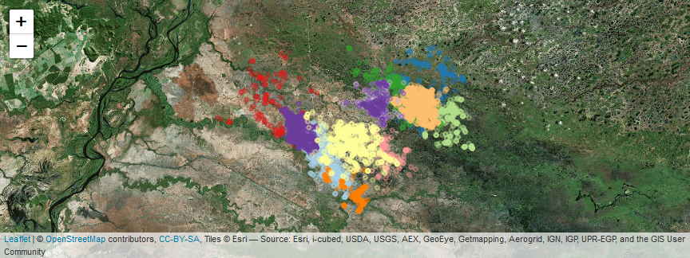

##### 3D plot


```r
open3d()
```

```
## wgl 
##   6
```

```r
# To get a bigger window than the default
par3d(windowRect = c(100, 100, 612, 612))
Sys.sleep(0.1) # Allow sluggish window managers to catch up
with(SaoBento, plot3d(x,y,date, type="l", col=as.favtor(SaoBento$id)))
```

```
## Error in as.favtor(SaoBento$id): could not find function "as.favtor"
```

```r
(stcube<-with(SaoBento, plot3d(x,y,date, type="l",col=as.numeric(cut(SaoBento$weight,11)), alpha=0.4)))
# Or with points
open3d()
```

```
## wgl 
##   7
```

```r
# To get a bigger window than the default
par3d(windowRect = c(100, 100, 612, 612))
Sys.sleep(0.1) # Allow sluggish window managers to catch up

with(SaoBento, plot3d(x,y,date, type="p", col=as.favtor(SaoBento$id)))
```

```
## Error in as.favtor(SaoBento$id): could not find function "as.favtor"
```

```r
(stcube<-with(SaoBento, plot3d(x,y,date, type="p",col=as.numeric(cut(SaoBento$weight,11)), alpha=0.4)))
```

## Some plots of movement characteristics

We can select id and steps, unnest the new data_frame and create a plot of the step-length distributions.


```r
trk %>% select(id, sl) %>% unnest %>% 
  ggplot(aes(sl, fill = factor(id))) + geom_density(alpha = 0.4)
```

```
## Warning: Removed 11 rows containing non-finite values (stat_density).
```

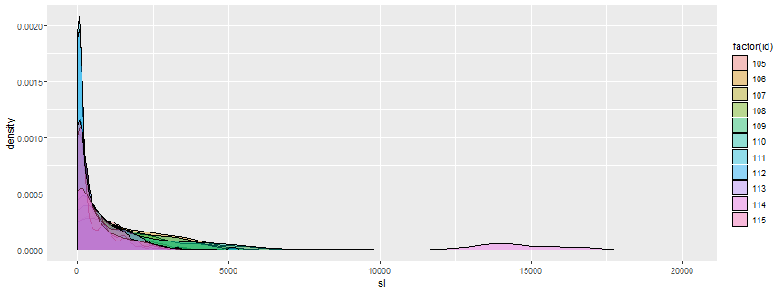

### Absolute angles (for each movement) relative to North 
We could use a rose diagram (below) to depict the distribution of angles. 


```r
ggplot(trk, aes(x = dir_abs, y=..density..)) + geom_histogram(breaks = seq(0,360, by=20))+
  coord_polar(start = 0) + theme_minimal() + 
  scale_fill_brewer() + ylab("Density") + ggtitle("Angles Direct") + 
  scale_x_continuous("", limits = c(0, 360), breaks = seq(0, 360, by=20), 
                     labels = seq(0, 360, by=20))+
  facet_wrap(~id)
```

```
## Warning: Removed 11 rows containing non-finite values (stat_bin).
```


### Turning angles 

Note: a 0 indicates the animal continued to move in a straight line, a 180 
indicates the animal turned around (but note, resting + measurement error often can
make it look like the animal turned around).


```r
ggplot(trk, aes(x = dir_rel, y=..density..)) + geom_histogram(breaks = seq(-180,180, by=20))+
  coord_polar(start = 0) + theme_minimal() + 
  scale_fill_brewer() + ylab("Density") + ggtitle("Angles Direct") + 
  scale_x_continuous("", limits = c(-180, 180), breaks = seq(-180, 180, by=20), 
                     labels = seq(-180, 180, by=20))+
  facet_wrap(~id)
```

```
## Warning: Removed 22 rows containing non-finite values (stat_bin).
```

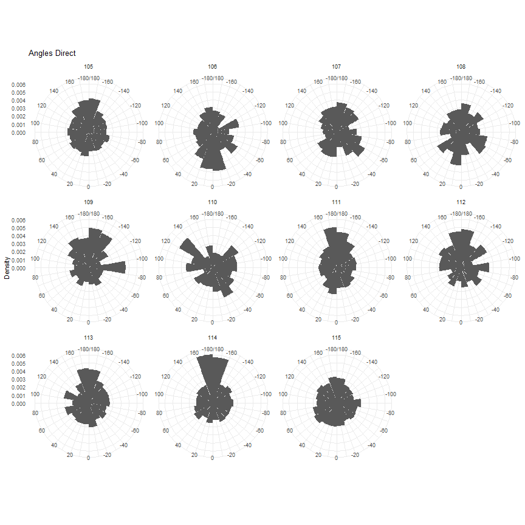

### Turning angles as histograms


```r
ggplot(trk, aes(x = dir_rel)) +  geom_histogram(breaks = seq(-180,180, by=20))+
  theme_minimal() + 
  scale_fill_brewer() + ylab("Count") + ggtitle("Angles Relative") + 
  scale_x_continuous("", limits = c(-180, 180), breaks = seq(-180, 180, by=20),
                     labels = seq(-180, 180, by=20))+facet_wrap(~id, scales="free")
```

```
## Warning: Removed 22 rows containing non-finite values (stat_bin).
```

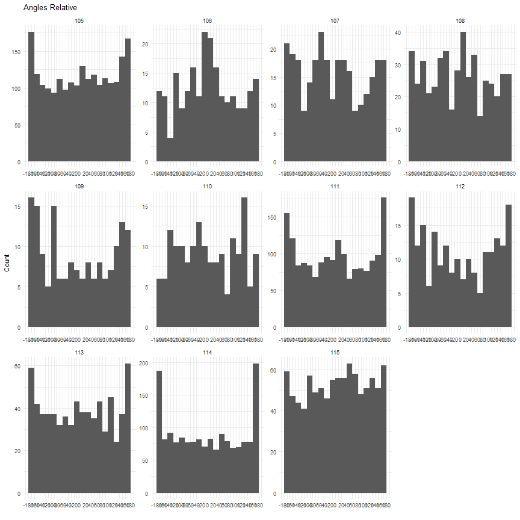

### Net-squared displacement over time for each individual


```r
ggplot(trk, aes(x = t_, y=nsd_)) + geom_point()+
  facet_wrap(~id, scales="free")
```


## Explore movement characteristics by (day/night, hour, month)

### step length distribution by day/night


```r
ggplot(trk, aes(x = tod_, y = log(sl)))+ geom_boxplot()+geom_smooth()+facet_wrap(~id)
```

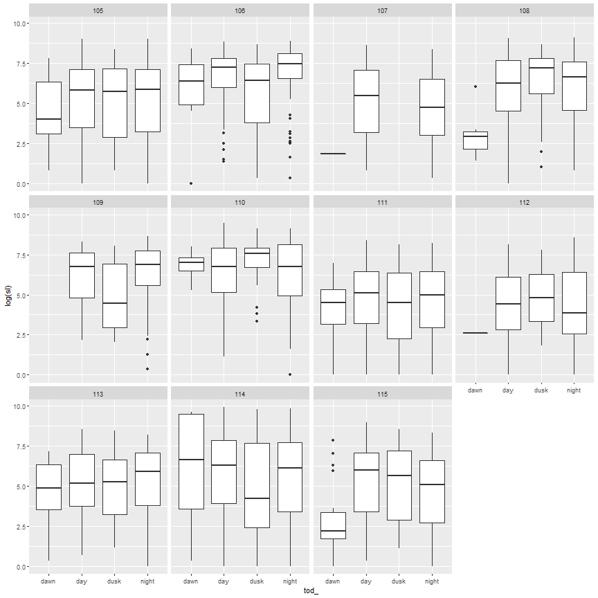

## GIS LAYERS in UTM  **These NEED BE ADJUSTED TO EACH INDIVIDUAL!!!**


```r
#  For now we use bases from ID 115 because its 70 Km radius emcompasses all the other individuals
```


Distances **These NEED BE RE-CALCULATED!!!**


```r
dist2drainage <-"D:/GISUTM/J115/UTM_b115_dist2drainage_exp.tif"
dist2water<-"D:/GISUTM/J115/UTM_b115_dist2waterbodies_exp.tif"
dist2forest <-"D:/GISUTM/J115/UTM_b115_dist2forestedges_Neotropic_Hansen_forest1_0_95percenttreecover_2000_30_tif_exp_edge_dist.tif"
dist2roads <-"D:/GISUTM/J115/UTM_b115_dist2roads_exp.tif"
```

Anthropic


```r
human_footprint<-"D:/GISUTM/J115/UTM_b115_human_footprint_2009_1km_tif_exp.tif"
Livestock<-"D:/GISUTM/J115/UTM_b115_Livestock_Cattle_CC2006_AD_1km_neotropic_albers_tif_exp.tif"
popdensity<-"D:/GISUTM/J115/UTM_b115_Population_density_gpw_v4_rev10_2015_1km_neotropic_albers_tif_exp.tif"
```

Landscape classificatiom and physical


```r
Landcover <-"D:/GISUTM/J115/UTM_b115_Landcover_ESACCI_2015_300m_neotropic_albers_tif_exp.tif"
treecover <-"D:/GISUTM/J115/UTM_b115_Neotropic_Hansen_percenttreecover_2000_30m_tif_exp.tif"
topo<-"D:/GISUTM/J115/UTM_b115_Neotropic_Earthenv_dem90m_tif_exp.tif"
water<-"D:/GISUTM/J115/UTM_b115_water_frequency_2010_30m_tif_exp.tif"
```

Check projection and images


```r
dist2drainage=raster(dist2drainage);crs(dist2drainage); plot(dist2drainage)
```

```
## CRS arguments:
##  +proj=utm +zone=21 +south +datum=WGS84 +units=m +no_defs +ellps=WGS84 +towgs84=0,0,0
```

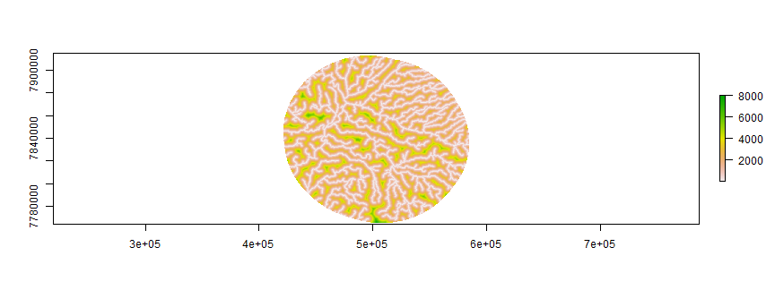

```r
dist2water=raster(dist2water); crs(dist2water); plot(dist2water)
```

```
## CRS arguments:
##  +proj=utm +zone=21 +south +datum=WGS84 +units=m +no_defs +ellps=WGS84 +towgs84=0,0,0
```

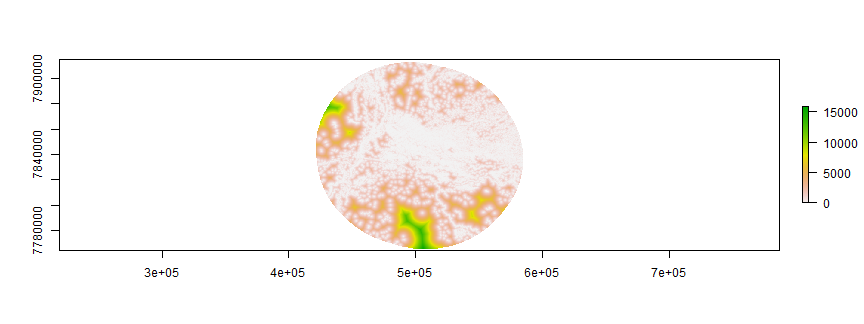

```r
dist2forest=raster(dist2forest); crs(dist2forest); plot(dist2forest)
```

```
## CRS arguments:
##  +proj=utm +zone=21 +south +datum=WGS84 +units=m +no_defs +ellps=WGS84 +towgs84=0,0,0
```

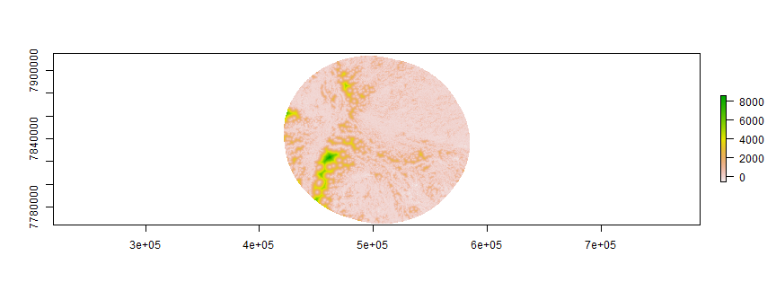

```r
dist2roads=raster(dist2roads); crs(dist2roads); plot(dist2roads)
```

```
## CRS arguments:
##  +proj=utm +zone=21 +south +datum=WGS84 +units=m +no_defs +ellps=WGS84 +towgs84=0,0,0
```

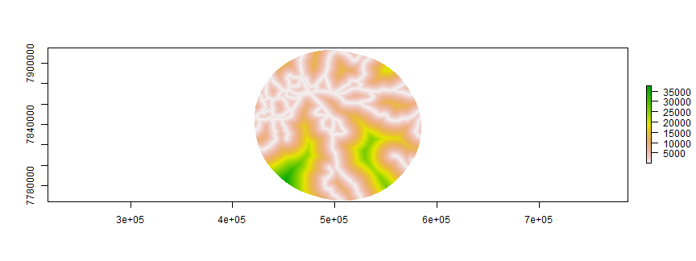

```r
human_footprint=raster(human_footprint); crs(human_footprint); plot(human_footprint)
```

```
## CRS arguments:
##  +proj=utm +zone=21 +south +datum=WGS84 +units=m +no_defs +ellps=WGS84 +towgs84=0,0,0
```


```r
Livestock=raster(Livestock); crs(Livestock); plot(Livestock)
```

```
## CRS arguments:
##  +proj=utm +zone=21 +south +datum=WGS84 +units=m +no_defs +ellps=WGS84 +towgs84=0,0,0
```

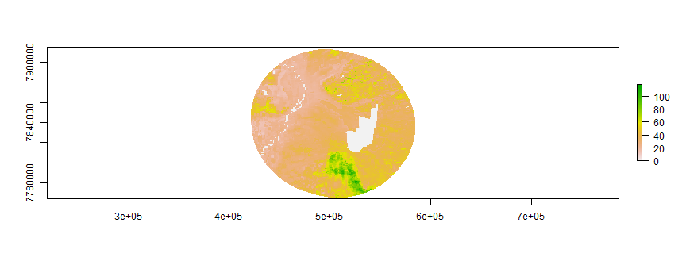

```r
popdensity=raster(popdensity); crs(popdensity); plot(popdensity)
```

```
## CRS arguments:
##  +proj=utm +zone=21 +south +datum=WGS84 +units=m +no_defs +ellps=WGS84 +towgs84=0,0,0
```

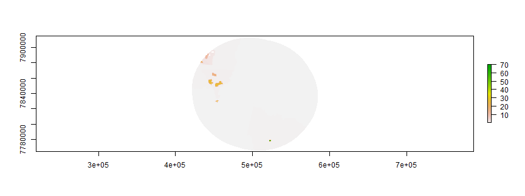

```r
Landcover=raster(Landcover); crs(Landcover); plot(Landcover)
```

```
## CRS arguments:
##  +proj=utm +zone=21 +south +datum=WGS84 +units=m +no_defs +ellps=WGS84 +towgs84=0,0,0
```

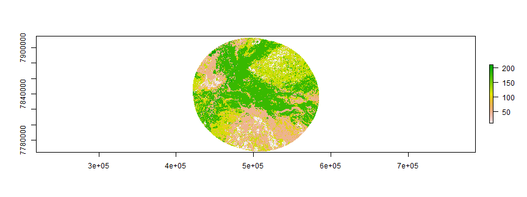

```r
treecover=raster(treecover); crs(treecover); plot(treecover)
```

```
## CRS arguments:
##  +proj=utm +zone=21 +south +datum=WGS84 +units=m +no_defs +ellps=WGS84 +towgs84=0,0,0
```

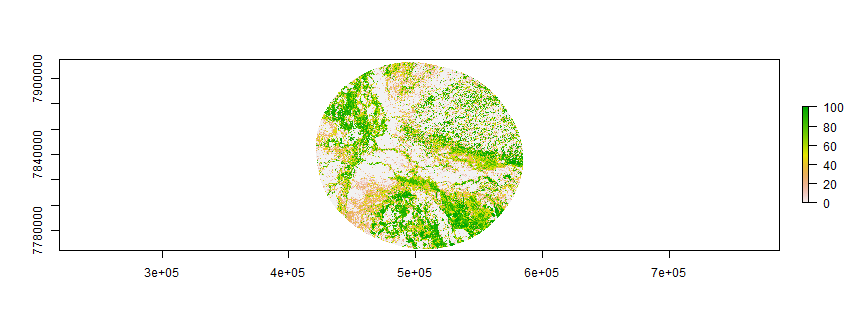

```r
topo=raster(topo); crs(topo); plot(topo)
```

```
## CRS arguments:
##  +proj=utm +zone=21 +south +datum=WGS84 +units=m +no_defs +ellps=WGS84 +towgs84=0,0,0
```

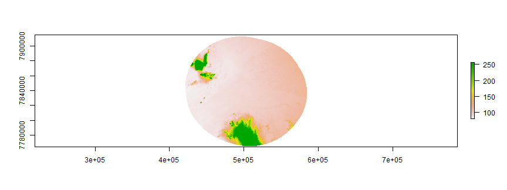

```r
water=raster(water); crs(water); plot(water)
```

```
## CRS arguments:
##  +proj=utm +zone=21 +south +datum=WGS84 +units=m +no_defs +ellps=WGS84 +towgs84=0,0,0
```

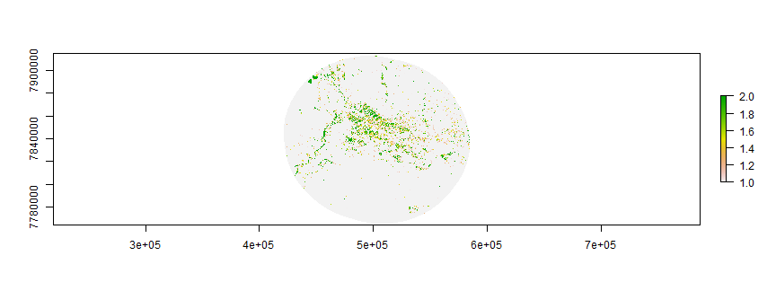


## SSF prep


```r
SaoBentotrk -> trk	
```

SSFs assume that data have been collected at regular time intervals.
We can use the track_resample function to regularize the trajectory so that
all points are located within some tolerence of each other in time. To figure
out a meaningful tolerance range, we should calculate time differences between
locations & look at as a function of individual.


```r
(timestats<-trk %>% nest(-id,-sex,-age,-weight,-status) %>% mutate(sr = map(data, summarize_sampling_rate, time_unit = "hour")) %>%
    select(id,sex,age,weight,status,sr) %>% unnest)
```

```
## # A tibble: 11 x 14
##       id sex      age weight status     min    q1 median  mean    q3   max     sd     n unit 
##    <int> <fct>  <dbl>  <dbl> <fct>    <dbl> <dbl>  <dbl> <dbl> <dbl> <dbl>  <dbl> <int> <chr>
##  1   105 Female   3       70 Resident 3         3      3  5.39     6    54   4.81  2110 hour 
##  2   106 Male     3      112 Resident 1.25      3      3 81.3      9  8763 797.     226 hour 
##  3   107 Male     9      124 Resident 3         3      3 11.0      6   963  58.9    286 hour 
##  4   108 Male     7      128 Resident 3         3      3  5.22     6    27   4.20   480 hour 
##  5   109 Female   3.5     68 Resident 3         3      3 11.6     12   234  21.5    164 hour 
##  6   110 Male     4      110 Resident 3         3      6 14.5     18   168  20.5    165 hour 
##  7   111 Female   8       92 Resident 0.45      3      3 13.9      6  7464 203.    1756 hour 
##  8   112 Female   0.8     22 Resident 1         3      3 10.7      6   465  36.0    201 hour 
##  9   113 Female   4.5     80 Resident 1         3      3 11.5      9  2850 107.     706 hour 
## 10   114 Female   8       76 Resident 0.967     3      3  5.67     6   102   7.09  1642 hour 
## 11   115 Female   2       44 Resident 3         3      3  6.63     6   567  20.8    951 hour
```

```r
## Lets add on the time difference to each obs.  Alerady DONE!!! 
#trk<-trk %>% group_by(id) %>% mutate(dt_ = t_ - lag(t_, default = NA))
#trk
```

Jaguar 105
Let's illustrate track regularization with ID = 105. Let's
keeping is as 3 hours with tolerance of 1 hours


```r
temp105<-trk %>% filter(id=="105") %>% track_resample(rate=hours(3), tolerance=hours(1))
temp105 %>% select(id, x_, y_, t_, burst_)
```

```
## # A tibble: 2,111 x 5
##       id      x_       y_ t_                      burst_
##  * <int>   <dbl>    <dbl> <dttm>                   <dbl>
##  1   105 494319. 7844358. 2008-07-05 03:51:00.000      1
##  2   105 494310. 7844361. 2008-07-05 07:00:00.000      1
##  3   105 494236. 7844455. 2008-07-05 16:00:00.000      2
##  4   105 494013. 7844530. 2008-07-05 19:00:00.000      2
##  5   105 494003. 7844494. 2008-07-06 01:00:00.000      3
##  6   105 493501. 7841571. 2008-07-06 16:00:00.000      4
##  7   105 494112. 7841517. 2008-07-06 19:00:00.000      4
##  8   105 494578. 7843720. 2008-07-06 22:00:00.000      4
##  9   105 494803. 7844304. 2008-07-07 04:00:00.000      5
## 10   105 495108. 7843456. 2008-07-07 07:00:00.000      5
## # ... with 2,101 more rows
```

```r
#Just checking it
summarize_sampling_rate(temp105)
```

```
## # A tibble: 1 x 9
##   min         q1          median      mean        q3          max            sd     n unit 
##   <S3: table> <S3: table> <S3: table> <S3: table> <S3: table> <S3: table> <dbl> <int> <chr>
## 1 3           3           3           5.39154     6           54           4.81  2110 hour
```

Before fitting a step selection, the data well need to prepared. First, we change from a point representation to a step representation, using the function steps_by_burst, which in contrast to the steps function accounts for bursts.


```r
ssf105 <- temp105 %>% steps_by_burst()
```

Next, we generate random steps with the function random_steps. This function fits by default a Gamma distribution to the step lengths and a von Mises distribution to the turn angles, and then pairs each observed step with n random steps.


```r
ssf105 <- ssf105 %>% random_steps(n = 15)
```

```
## Warning in random_steps.steps_xy(., n = 15): Step-lengths or turning angles contained NA, which were removed.
```

As a last step, we have to extract the covariates at the end point of each step. We can do this with extract_covariates.


```r
ssf105 <- ssf105 %>% extract_covariates(dist2drainage); ssf105 <- rename(ssf105, dist2drainage = UTM_b115_dist2drainage_exp)
ssf105 <- ssf105 %>% extract_covariates(dist2water); ssf105 <- rename(ssf105, dist2water = UTM_b115_dist2waterbodies_exp) 
ssf105 <- ssf105 %>% extract_covariates(dist2forest);ssf105 <- rename(ssf105, dist2forest =UTM_b115_dist2forestedges_Neotropic_Hansen_forest1_0_95percenttreecover_2000_30_tif_exp_edge_dist)  
ssf105 <- ssf105 %>% extract_covariates(dist2roads); ssf105 <- rename(ssf105, dist2roads = UTM_b115_dist2roads_exp) 
ssf105 <- ssf105 %>% extract_covariates(human_footprint); ssf105 <- rename(ssf105, human_footprint = UTM_b115_human_footprint_2009_1km_tif_exp) 
ssf105 <- ssf105 %>% extract_covariates(Livestock); ssf105 <- rename(ssf105, Livestock = UTM_b115_Livestock_Cattle_CC2006_AD_1km_neotropic_albers_tif_exp) 
ssf105 <- ssf105 %>% extract_covariates(popdensity); ssf105 <- rename(ssf105, popdensity =UTM_b115_Population_density_gpw_v4_rev10_2015_1km_neotropic_albers_tif_exp) 
ssf105 <- ssf105 %>% extract_covariates(Landcover); ssf105 <- rename(ssf105, Landcover = UTM_b115_Landcover_ESACCI_2015_300m_neotropic_albers_tif_exp) 
ssf105 <- ssf105 %>% extract_covariates(treecover); ssf105 <- rename(ssf105, treecover = UTM_b115_Neotropic_Hansen_percenttreecover_2000_30m_tif_exp) 
ssf105 <- ssf105 %>% extract_covariates(topo); ssf105 <- rename(ssf105, topo = UTM_b115_Neotropic_Earthenv_dem90m_tif_exp)  
ssf105 <- ssf105 %>% extract_covariates(water); ssf105 <- rename(ssf105, water = UTM_b115_water_frequency_2010_30m_tif_exp)  

print(ssf105, width=Inf)
```

```
## # A tibble: 15,152 x 23
##    burst_ step_id_ case_     x1_      y1_     x2_      y2_ t1_                     t2_                     dt_           sl_    ta_ dist2drainage dist2water
##  *  <dbl>    <int> <lgl>   <dbl>    <dbl>   <dbl>    <dbl> <dttm>                  <dttm>                  <time>      <dbl>  <dbl>         <dbl>      <dbl>
##  1      4        1 TRUE  494112. 7841517. 494578. 7843720. 2008-07-06 19:00:00.000 2008-07-06 22:00:00.000 3 hours 2252.       83.1          33.1      17.9 
##  2      4        1 FALSE 494112. 7841517. 494112. 7841518. 2008-07-06 19:00:00.000 2008-07-06 22:00:00.000 3 hours    0.691   -30.4        1806.       93.3 
##  3      4        1 FALSE 494112. 7841517. 490581. 7840189. 2008-07-06 19:00:00.000 2008-07-06 22:00:00.000 3 hours 3772.      129.         3980.       81.5 
##  4      4        1 FALSE 494112. 7841517. 494396. 7841500. 2008-07-06 19:00:00.000 2008-07-06 22:00:00.000 3 hours  285.      -50.3        1604.       91.9 
##  5      4        1 FALSE 494112. 7841517. 494097. 7841520. 2008-07-06 19:00:00.000 2008-07-06 22:00:00.000 3 hours   15.3     103.         1811.      114.  
##  6      4        1 FALSE 494112. 7841517. 493746. 7841567. 2008-07-06 19:00:00.000 2008-07-06 22:00:00.000 3 hours  369.     -123.         2040.       28.8 
##  7      4        1 FALSE 494112. 7841517. 494000. 7841453. 2008-07-06 19:00:00.000 2008-07-06 22:00:00.000 3 hours  129.      -52.9        1937.        8.55
##  8      4        1 FALSE 494112. 7841517. 497208. 7839964. 2008-07-06 19:00:00.000 2008-07-06 22:00:00.000 3 hours 3464.     -176.          633.      126.  
##  9      4        1 FALSE 494112. 7841517. 494104. 7841512. 2008-07-06 19:00:00.000 2008-07-06 22:00:00.000 3 hours    9.71    -34.0        1830.       87.3 
## 10      4        1 FALSE 494112. 7841517. 494112. 7841517. 2008-07-06 19:00:00.000 2008-07-06 22:00:00.000 3 hours    0.0215 -123.         1806.       93.3 
##    dist2forest dist2roads human_footprint Livestock popdensity Landcover treecover  topo water
##  *       <dbl>      <dbl>           <dbl>     <dbl>      <dbl>     <dbl>     <dbl> <dbl> <dbl>
##  1        158.      3432.            5.81      31.7     0.131       180     0.0644  90    1.49
##  2        482.      3919.            5.27      31.9     0.131       180     6.81    90    1   
##  3        732.      2906.            8.03      33.2     0.0735      180    20.4     90    1   
##  4        368.      3650.            5.27      31.9     0.131       180    15.4     90    1   
##  5        481.      3951.            5.27      31.9     0.131       180    18.9     90    1   
##  6        737.      4282.            7.09      41.6     0.131       180     4.52    90    1.24
##  7        608.      4034.            5.27      31.9     0.131       123.    0       90    1.71
##  8       1540.       899.           11.0       32.3     0.131       180     0       90.0  1   
##  9        503.      3949.            5.27      31.9     0.131       180     5.92    90    1   
## 10        482.      3919.            5.27      31.9     0.131       180     6.81    90    1   
## # ... with 15,142 more rows
```


Jaguar 106
Let's illustrate track regularization with ID = 106. Let's
keeping is as 3 hours with tolerance of 1 hours


```r
temp106<-trk %>% filter(id=="106") %>% track_resample(rate=hours(3), tolerance=hours(1))
temp106 %>% select(id, x_, y_, t_, burst_)
```

```
## # A tibble: 226 x 5
##       id      x_       y_ t_                      burst_
##  * <int>   <dbl>    <dbl> <dttm>                   <dbl>
##  1   106 511629. 7847431. 2009-09-24 05:45:00.000      1
##  2   106 511693. 7848539. 2009-09-24 22:00:00.000      2
##  3   106 511677. 7848534. 2009-09-25 01:00:00.000      2
##  4   106 512207. 7845058. 2009-09-25 22:00:00.000      3
##  5   106 513193. 7843766. 2009-09-26 01:00:00.000      3
##  6   106 514800. 7844913. 2009-09-26 16:00:00.000      4
##  7   106 513583. 7845316. 2009-09-26 19:00:00.000      4
##  8   106 513586. 7845312. 2009-09-26 22:00:00.000      4
##  9   106 512856. 7845642. 2009-09-27 01:00:00.000      4
## 10   106 512232. 7845471. 2009-09-27 07:00:00.000      5
## # ... with 216 more rows
```

```r
#Just checking it
summarize_sampling_rate(temp106)
```

```
## # A tibble: 1 x 9
##   min         q1          median      mean        q3          max            sd     n unit 
##   <S3: table> <S3: table> <S3: table> <S3: table> <S3: table> <S3: table> <dbl> <int> <chr>
## 1 3           3           3           81.65889    9           8763         799.   225 hour
```

Before fitting a step selection, the data well need to prepared. First, we change from a point representation to a step representation, using the function steps_by_burst, which in contrast to the steps function accounts for bursts.


```r
ssf106 <- temp106 %>% steps_by_burst()
```

Next, we generate random steps with the function random_steps. This function fits by default a Gamma distribution to the step lengths and a von Mises distribution to the turn angles, and then pairs each observed step with n random steps.


```r
ssf106 <- ssf106 %>% random_steps(n = 15)
```

```
## Warning in random_steps.steps_xy(., n = 15): Step-lengths or turning angles contained NA, which were removed.
```

As a last step, we have to extract the covariates at the end point of each step. We can do this with extract_covariates.


```r
ssf106 <- ssf106 %>% extract_covariates(dist2drainage); ssf106 <- rename(ssf106, dist2drainage = UTM_b115_dist2drainage_exp)
ssf106 <- ssf106 %>% extract_covariates(dist2water); ssf106 <- rename(ssf106, dist2water = UTM_b115_dist2waterbodies_exp) 
ssf106 <- ssf106 %>% extract_covariates(dist2forest);ssf106 <- rename(ssf106, dist2forest =UTM_b115_dist2forestedges_Neotropic_Hansen_forest1_0_95percenttreecover_2000_30_tif_exp_edge_dist)  
ssf106 <- ssf106 %>% extract_covariates(dist2roads); ssf106 <- rename(ssf106, dist2roads = UTM_b115_dist2roads_exp) 
ssf106 <- ssf106 %>% extract_covariates(human_footprint); ssf106 <- rename(ssf106, human_footprint = UTM_b115_human_footprint_2009_1km_tif_exp) 
ssf106 <- ssf106 %>% extract_covariates(Livestock); ssf106 <- rename(ssf106, Livestock = UTM_b115_Livestock_Cattle_CC2006_AD_1km_neotropic_albers_tif_exp) 
ssf106 <- ssf106 %>% extract_covariates(popdensity); ssf106 <- rename(ssf106, popdensity =UTM_b115_Population_density_gpw_v4_rev10_2015_1km_neotropic_albers_tif_exp) 
ssf106 <- ssf106 %>% extract_covariates(Landcover); ssf106 <- rename(ssf106, Landcover = UTM_b115_Landcover_ESACCI_2015_300m_neotropic_albers_tif_exp) 
ssf106 <- ssf106 %>% extract_covariates(treecover); ssf106 <- rename(ssf106, treecover = UTM_b115_Neotropic_Hansen_percenttreecover_2000_30m_tif_exp) 
ssf106 <- ssf106 %>% extract_covariates(topo); ssf106 <- rename(ssf106, topo = UTM_b115_Neotropic_Earthenv_dem90m_tif_exp)  
ssf106 <- ssf106 %>% extract_covariates(water); ssf106 <- rename(ssf106, water = UTM_b115_water_frequency_2010_30m_tif_exp)  

print(ssf106, width=Inf)
```

```
## # A tibble: 1,376 x 23
##    burst_ step_id_ case_     x1_      y1_     x2_      y2_ t1_                     t2_                     dt_         sl_     ta_ dist2drainage dist2water
##  *  <dbl>    <int> <lgl>   <dbl>    <dbl>   <dbl>    <dbl> <dttm>                  <dttm>                  <time>    <dbl>   <dbl>         <dbl>      <dbl>
##  1      4        1 TRUE  513583. 7845316. 513586. 7845312. 2009-09-26 19:00:00.000 2009-09-26 22:00:00.000 3 hours    5.00  145.           1263.     156.  
##  2      4        1 FALSE 513583. 7845316. 513479. 7844217. 2009-09-26 19:00:00.000 2009-09-26 22:00:00.000 3 hours 1104.   -108.            108.     284.  
##  3      4        1 FALSE 513583. 7845316. 513582. 7845336. 2009-09-26 19:00:00.000 2009-09-26 22:00:00.000 3 hours   20.1    64.4          1263.     156.  
##  4      4        1 FALSE 513583. 7845316. 513393. 7843282. 2009-09-26 19:00:00.000 2009-09-26 22:00:00.000 3 hours 2043.     92.6           564.      99.4 
##  5      4        1 FALSE 513583. 7845316. 510941. 7843596. 2009-09-26 19:00:00.000 2009-09-26 22:00:00.000 3 hours 3152.     98.0           561.       4.40
##  6      4        1 FALSE 513583. 7845316. 513587. 7845316. 2009-09-26 19:00:00.000 2009-09-26 22:00:00.000 3 hours    3.62  107.           1263.     156.  
##  7      4        1 FALSE 513583. 7845316. 515475. 7847043. 2009-09-26 19:00:00.000 2009-09-26 22:00:00.000 3 hours 2562.     -5.54         1803.     206.  
##  8      4        1 FALSE 513583. 7845316. 513211. 7844910. 2009-09-26 19:00:00.000 2009-09-26 22:00:00.000 3 hours  551.     -2.31          803.      82.6 
##  9      4        1 FALSE 513583. 7845316. 513745. 7845465. 2009-09-26 19:00:00.000 2009-09-26 22:00:00.000 3 hours  220.     88.7          1439.      18.7 
## 10      4        1 FALSE 513583. 7845316. 513527. 7845624. 2009-09-26 19:00:00.000 2009-09-26 22:00:00.000 3 hours  313.   -149.           1583.       7.38
##    dist2forest dist2roads human_footprint Livestock popdensity Landcover treecover  topo water
##  *       <dbl>      <dbl>           <dbl>     <dbl>      <dbl>     <dbl>     <dbl> <dbl> <dbl>
##  1        68.4      9186.            2.25      34.0      0.131       180      23.7  94    1   
##  2       156.       8715.            2.26      33.8      0.131       180      26.9  92.6  1   
##  3        68.4      9186.            2.25      34.0      0.131       180      23.7  94    1   
##  4       302.       8355.            2.25      32.9      0.131       180      30.2  93    1   
##  5       155.       6226.            2.28      23.3      0.131       180      53.0  92    1.85
##  6        68.4      9186.            2.25      34.0      0.131       180      23.7  94    1   
##  7        69.1     11511.            1.25      35.9      0.131       180      41.3  93    1   
##  8        36.0      8709.            2.25      32.8      0.131       180      82.2  94.1  1   
##  9        40.7      9376.            1.44      33.4      0.131       180      72.6  93.7  1.43
## 10       243.       9236.            2.25      34.0      0.131       180      18.4  93    1.75
## # ... with 1,366 more rows
```


Jaguar 107
Let's illustrate track regularization with ID = 107. Let's
keeping is as 3 hours with tolerance of 1 hours


```r
temp107<-trk %>% filter(id=="107") %>% track_resample(rate=hours(3), tolerance=hours(1))
temp107 %>% select(id, x_, y_, t_, burst_)
```

```
## # A tibble: 287 x 5
##       id      x_       y_ t_                      burst_
##  * <int>   <dbl>    <dbl> <dttm>                   <dbl>
##  1   107 517858. 7846433. 2008-07-30 07:00:00.000      1
##  2   107 517807. 7846416. 2008-07-30 10:00:00.000      1
##  3   107 517793. 7846421. 2008-07-30 22:00:00.000      2
##  4   107 517837. 7845982. 2008-07-31 01:00:00.000      2
##  5   107 518613. 7844690. 2008-07-31 07:00:00.000      3
##  6   107 520107. 7846932. 2008-07-31 16:00:00.000      4
##  7   107 520108. 7846936. 2008-07-31 19:00:00.000      4
##  8   107 521334. 7846296. 2008-08-01 04:00:00.000      5
##  9   107 521330. 7846295. 2008-08-01 13:00:00.000      6
## 10   107 521961. 7846588. 2008-08-01 16:00:00.000      6
## # ... with 277 more rows
```

```r
#Just checking it
summarize_sampling_rate(temp107)
```

```
## # A tibble: 1 x 9
##   min         q1          median      mean        q3          max            sd     n unit 
##   <S3: table> <S3: table> <S3: table> <S3: table> <S3: table> <S3: table> <dbl> <int> <chr>
## 1 3           3           3           11.03497    6           963          58.9   286 hour
```

Before fitting a step selection, the data well need to prepared. First, we change from a point representation to a step representation, using the function steps_by_burst, which in contrast to the steps function accounts for bursts.


```r
ssf107 <- temp107 %>% steps_by_burst()
```

Next, we generate random steps with the function random_steps. This function fits by default a Gamma distribution to the step lengths and a von Mises distribution to the turn angles, and then pairs each observed step with n random steps.


```r
ssf107 <- ssf107 %>% random_steps(n = 15)
```

```
## Warning in random_steps.steps_xy(., n = 15): Step-lengths or turning angles contained NA, which were removed.
```

As a last step, we have to extract the covariates at the end point of each step. We can do this with extract_covariates.


```r
ssf107 <- ssf107 %>% extract_covariates(dist2drainage); ssf107 <- rename(ssf107, dist2drainage = UTM_b115_dist2drainage_exp)
ssf107 <- ssf107 %>% extract_covariates(dist2water); ssf107 <- rename(ssf107, dist2water = UTM_b115_dist2waterbodies_exp) 
ssf107 <- ssf107 %>% extract_covariates(dist2forest);ssf107 <- rename(ssf107, dist2forest =UTM_b115_dist2forestedges_Neotropic_Hansen_forest1_0_95percenttreecover_2000_30_tif_exp_edge_dist)  
ssf107 <- ssf107 %>% extract_covariates(dist2roads); ssf107 <- rename(ssf107, dist2roads = UTM_b115_dist2roads_exp) 
ssf107 <- ssf107 %>% extract_covariates(human_footprint); ssf107 <- rename(ssf107, human_footprint = UTM_b115_human_footprint_2009_1km_tif_exp) 
ssf107 <- ssf107 %>% extract_covariates(Livestock); ssf107 <- rename(ssf107, Livestock = UTM_b115_Livestock_Cattle_CC2006_AD_1km_neotropic_albers_tif_exp) 
ssf107 <- ssf107 %>% extract_covariates(popdensity); ssf107 <- rename(ssf107, popdensity =UTM_b115_Population_density_gpw_v4_rev10_2015_1km_neotropic_albers_tif_exp) 
ssf107 <- ssf107 %>% extract_covariates(Landcover); ssf107 <- rename(ssf107, Landcover = UTM_b115_Landcover_ESACCI_2015_300m_neotropic_albers_tif_exp) 
ssf107 <- ssf107 %>% extract_covariates(treecover); ssf107 <- rename(ssf107, treecover = UTM_b115_Neotropic_Hansen_percenttreecover_2000_30m_tif_exp) 
ssf107 <- ssf107 %>% extract_covariates(topo); ssf107 <- rename(ssf107, topo = UTM_b115_Neotropic_Earthenv_dem90m_tif_exp)  
ssf107 <- ssf107 %>% extract_covariates(water); ssf107 <- rename(ssf107, water = UTM_b115_water_frequency_2010_30m_tif_exp)  

print(ssf107, width=Inf)
```

```
## # A tibble: 1,840 x 23
##    burst_ step_id_ case_     x1_      y1_     x2_      y2_ t1_                     t2_                     dt_         sl_    ta_ dist2drainage dist2water
##  *  <dbl>    <int> <lgl>   <dbl>    <dbl>   <dbl>    <dbl> <dttm>                  <dttm>                  <time>    <dbl>  <dbl>         <dbl>      <dbl>
##  1     10        1 TRUE  521972. 7848754. 522098. 7848655. 2008-08-03 07:00:00.000 2008-08-03 10:00:00.000 3 hours  160.    -44.4         3224.      35.5 
##  2     10        1 FALSE 521972. 7848754. 521971. 7848752. 2008-08-03 07:00:00.000 2008-08-03 10:00:00.000 3 hours    2.49   79.7         3257.      21.2 
##  3     10        1 FALSE 521972. 7848754. 523408. 7848576. 2008-08-03 07:00:00.000 2008-08-03 10:00:00.000 3 hours 1446.     62.7         2123.      18.1 
##  4     10        1 FALSE 521972. 7848754. 521979. 7848741. 2008-08-03 07:00:00.000 2008-08-03 10:00:00.000 3 hours   14.9    86.9         3257.      21.2 
##  5     10        1 FALSE 521972. 7848754. 523337. 7850192. 2008-08-03 07:00:00.000 2008-08-03 10:00:00.000 3 hours 1983.     76.2         1284.       0   
##  6     10        1 FALSE 521972. 7848754. 521251. 7849022. 2008-08-03 07:00:00.000 2008-08-03 10:00:00.000 3 hours  769.    -97.7         3587.      20.6 
##  7     10        1 FALSE 521972. 7848754. 522016. 7848950. 2008-08-03 07:00:00.000 2008-08-03 10:00:00.000 3 hours  201.    177.          3100.       9.72
##  8     10        1 FALSE 521972. 7848754. 522116. 7846586. 2008-08-03 07:00:00.000 2008-08-03 10:00:00.000 3 hours 2173.    -20.4         2936.      91.3 
##  9     10        1 FALSE 521972. 7848754. 522338. 7848341. 2008-08-03 07:00:00.000 2008-08-03 10:00:00.000 3 hours  552.     30.6         2905.      39.6 
## 10     10        1 FALSE 521972. 7848754. 521957. 7848795. 2008-08-03 07:00:00.000 2008-08-03 10:00:00.000 3 hours   43.6   -23.2         3219.      20.7 
##    dist2forest dist2roads human_footprint Livestock popdensity Landcover treecover  topo water
##  *       <dbl>      <dbl>           <dbl>     <dbl>      <dbl>     <dbl>     <dbl> <dbl> <dbl>
##  1       -4.48     11926.            1.25      34.3      0.131       180      94.7  96.7  1.16
##  2      -11.3      11904.            1.25      33.5      0.131       180      93.5  96.3  1.35
##  3       75.6      11465.            1.25      35.1      0.131       180      17.6  96    1.46
##  4      -11.3      11904.            1.25      33.5      0.131       180      93.5  96.3  1.35
##  5      186.        9951.            1.25      32.2      0.131       180      36.5  95    2   
##  6      124.       12001.            1.25      31.8      0.131       180      38.2  95.0  1.31
##  7      144.       11707.            1.25      34.3      0.131       180      25.6  95    1.68
##  8       95.9      13876.            1.25      32.2      0.131       180      66.8  96    1   
##  9      104.       12107.            1.25      34.3      0.131       180      63.7  95    1.08
## 10       19.2      11852.            1.25      33.6      0.131       180      83.4  95.6  1.31
## # ... with 1,830 more rows
```


Jaguar 108
Let's illustrate track regularization with ID = 108. Let's
keeping is as 3 hours with tolerance of 1 hours


```r
temp108<-trk %>% filter(id=="108") %>% track_resample(rate=hours(3), tolerance=hours(1))
temp108 %>% select(id, x_, y_, t_, burst_)
```

```
## # A tibble: 481 x 5
##       id      x_       y_ t_                      burst_
##  * <int>   <dbl>    <dbl> <dttm>                   <dbl>
##  1   108 509710. 7851631. 2008-07-25 03:33:00.000      1
##  2   108 509707. 7851645. 2008-07-25 07:00:00.000      1
##  3   108 509750. 7851669. 2008-07-25 16:00:00.000      2
##  4   108 512179. 7847678. 2008-07-25 19:00:00.000      2
##  5   108 512131. 7847474. 2008-07-25 22:00:00.000      2
##  6   108 511477. 7846474. 2008-07-26 16:00:00.000      3
##  7   108 509924. 7847992. 2008-07-26 19:00:00.000      3
##  8   108 507169. 7850108. 2008-07-26 22:00:00.000      3
##  9   108 506246. 7847996. 2008-07-27 01:00:00.000      3
## 10   108 508235. 7851615. 2008-07-27 04:00:00.000      3
## # ... with 471 more rows
```

```r
#Just checking it
summarize_sampling_rate(temp108)
```

```
## # A tibble: 1 x 9
##   min         q1          median      mean        q3          max            sd     n unit 
##   <S3: table> <S3: table> <S3: table> <S3: table> <S3: table> <S3: table> <dbl> <int> <chr>
## 1 3           3           3           5.219688    6           27           4.20   480 hour
```

Before fitting a step selection, the data well need to prepared. First, we change from a point representation to a step representation, using the function steps_by_burst, which in contrast to the steps function accounts for bursts.


```r
ssf108 <- temp108 %>% steps_by_burst()
```

Next, we generate random steps with the function random_steps. This function fits by default a Gamma distribution to the step lengths and a von Mises distribution to the turn angles, and then pairs each observed step with n random steps.


```r
ssf108 <- ssf108 %>% random_steps(n = 15)
```

```
## Warning in random_steps.steps_xy(., n = 15): Step-lengths or turning angles contained NA, which were removed.
```

As a last step, we have to extract the covariates at the end point of each step. We can do this with extract_covariates.


```r
ssf108 <- ssf108 %>% extract_covariates(dist2drainage); ssf108 <- rename(ssf108, dist2drainage = UTM_b115_dist2drainage_exp)
ssf108 <- ssf108 %>% extract_covariates(dist2water); ssf108 <- rename(ssf108, dist2water = UTM_b115_dist2waterbodies_exp) 
ssf108 <- ssf108 %>% extract_covariates(dist2forest);ssf108 <- rename(ssf108, dist2forest =UTM_b115_dist2forestedges_Neotropic_Hansen_forest1_0_95percenttreecover_2000_30_tif_exp_edge_dist)  
ssf108 <- ssf108 %>% extract_covariates(dist2roads); ssf108 <- rename(ssf108, dist2roads = UTM_b115_dist2roads_exp) 
ssf108 <- ssf108 %>% extract_covariates(human_footprint); ssf108 <- rename(ssf108, human_footprint = UTM_b115_human_footprint_2009_1km_tif_exp) 
ssf108 <- ssf108 %>% extract_covariates(Livestock); ssf108 <- rename(ssf108, Livestock = UTM_b115_Livestock_Cattle_CC2006_AD_1km_neotropic_albers_tif_exp) 
ssf108 <- ssf108 %>% extract_covariates(popdensity); ssf108 <- rename(ssf108, popdensity =UTM_b115_Population_density_gpw_v4_rev10_2015_1km_neotropic_albers_tif_exp) 
ssf108 <- ssf108 %>% extract_covariates(Landcover); ssf108 <- rename(ssf108, Landcover = UTM_b115_Landcover_ESACCI_2015_300m_neotropic_albers_tif_exp) 
ssf108 <- ssf108 %>% extract_covariates(treecover); ssf108 <- rename(ssf108, treecover = UTM_b115_Neotropic_Hansen_percenttreecover_2000_30m_tif_exp) 
ssf108 <- ssf108 %>% extract_covariates(topo); ssf108 <- rename(ssf108, topo = UTM_b115_Neotropic_Earthenv_dem90m_tif_exp)  
ssf108 <- ssf108 %>% extract_covariates(water); ssf108 <- rename(ssf108, water = UTM_b115_water_frequency_2010_30m_tif_exp)  

print(ssf108, width=Inf)
```

```
## # A tibble: 3,424 x 23
##    burst_ step_id_ case_     x1_      y1_     x2_      y2_ t1_                     t2_                     dt_        sl_     ta_ dist2drainage dist2water
##  *  <dbl>    <int> <lgl>   <dbl>    <dbl>   <dbl>    <dbl> <dttm>                  <dttm>                  <time>   <dbl>   <dbl>         <dbl>      <dbl>
##  1      2        1 TRUE  512179. 7847678. 512131. 7847474. 2008-07-25 19:00:00.000 2008-07-25 22:00:00.000 3 hours  210.   -44.6          2395.     170.  
##  2      2        1 FALSE 512179. 7847678. 511820. 7847048. 2008-07-25 19:00:00.000 2008-07-25 22:00:00.000 3 hours  725.   -83.8          2599.     168.  
##  3      2        1 FALSE 512179. 7847678. 512093. 7847418. 2008-07-25 19:00:00.000 2008-07-25 22:00:00.000 3 hours  273.    86.1          2460.     181.  
##  4      2        1 FALSE 512179. 7847678. 512522. 7847583. 2008-07-25 19:00:00.000 2008-07-25 22:00:00.000 3 hours  356.   -82.0          2046.     123.  
##  5      2        1 FALSE 512179. 7847678. 511983. 7846832. 2008-07-25 19:00:00.000 2008-07-25 22:00:00.000 3 hours  868.   -20.6          2351.     140.  
##  6      2        1 FALSE 512179. 7847678. 512936. 7848504. 2008-07-25 19:00:00.000 2008-07-25 22:00:00.000 3 hours 1120.    95.1          1106.       7.79
##  7      2        1 FALSE 512179. 7847678. 511995. 7847433. 2008-07-25 19:00:00.000 2008-07-25 22:00:00.000 3 hours  306.     4.07         2530.     116.  
##  8      2        1 FALSE 512179. 7847678. 513112. 7847632. 2008-07-25 19:00:00.000 2008-07-25 22:00:00.000 3 hours  934.   -81.7          1574.     187.  
##  9      2        1 FALSE 512179. 7847678. 512189. 7847685. 2008-07-25 19:00:00.000 2008-07-25 22:00:00.000 3 hours   12.7  164.           2218.     224.  
## 10      2        1 FALSE 512179. 7847678. 512458. 7845768. 2008-07-25 19:00:00.000 2008-07-25 22:00:00.000 3 hours 1930.   -58.0          1290.      34.2 
##    dist2forest dist2roads human_footprint Livestock popdensity Landcover treecover  topo water
##  *       <dbl>      <dbl>           <dbl>     <dbl>      <dbl>     <dbl>     <dbl> <dbl> <dbl>
##  1       -56.1      8929.            1.25      33.6      0.131       180      99.2  94.7  1   
##  2       158.       8455.            2.26      33.6      0.131       180      19.0  92    1   
##  3        15.9      8862.            1.25      33.6      0.131       180      91.3  94.0  1   
##  4        38.3      9303.            1.25      33.6      0.131       180      63.1  93    1   
##  5       -22.1      8453.            2.26      33.6      0.131       180      92.4  96.0  1   
##  6       183.      10118.            1.25      33.2      0.131       180      11.6  93    1.74
##  7        13.7      8782.            1.25      33.6      0.131       180      88.3  94.0  1   
##  8       144.       9814.            1.25      33.9      0.131       180      29.0  92    1   
##  9       -40.7      9066.            1.25      33.6      0.131       180     100.0  94.0  1   
## 10       -23.3      8343.            2.26      33.5      0.131       180      93.0  95.5  1.11
## # ... with 3,414 more rows
```


Jaguar 109
Let's illustrate track regularization with ID = 109. Let's
keeping is as 3 hours with tolerance of 1 hours


```r
temp109<-trk %>% filter(id=="109") %>% track_resample(rate=hours(3), tolerance=hours(1))
temp109 %>% select(id, x_, y_, t_, burst_)
```

```
## # A tibble: 165 x 5
##       id      x_       y_ t_                      burst_
##  * <int>   <dbl>    <dbl> <dttm>                   <dbl>
##  1   109 507983. 7840307. 2008-08-04 16:00:00.000      1
##  2   109 507864. 7839976. 2008-08-04 19:00:00.000      1
##  3   109 508879. 7839931. 2008-08-06 16:00:00.000      2
##  4   109 510175. 7838415. 2008-08-06 19:00:00.000      2
##  5   109 508681. 7836457. 2008-08-08 19:00:00.000      3
##  6   109 508741. 7836438. 2008-08-08 22:00:00.000      3
##  7   109 509517. 7838473. 2008-08-09 01:00:00.000      3
##  8   109 510995. 7837640. 2008-08-09 16:00:00.000      4
##  9   109 510886. 7837817. 2008-08-09 19:00:00.000      4
## 10   109 510675. 7838410. 2008-08-11 19:00:00.000      5
## # ... with 155 more rows
```

```r
#Just checking it
summarize_sampling_rate(temp109)
```

```
## # A tibble: 1 x 9
##   min         q1          median      mean        q3          max            sd     n unit 
##   <S3: table> <S3: table> <S3: table> <S3: table> <S3: table> <S3: table> <dbl> <int> <chr>
## 1 3           3           3           11.57927    12          234          21.5   164 hour
```

Before fitting a step selection, the data well need to prepared. First, we change from a point representation to a step representation, using the function steps_by_burst, which in contrast to the steps function accounts for bursts.


```r
ssf109 <- temp109 %>% steps_by_burst()
```

Next, we generate random steps with the function random_steps. This function fits by default a Gamma distribution to the step lengths and a von Mises distribution to the turn angles, and then pairs each observed step with n random steps.


```r
ssf109 <- ssf109 %>% random_steps(n = 15)
```

```
## Warning in random_steps.steps_xy(., n = 15): Step-lengths or turning angles contained NA, which were removed.
```

As a last step, we have to extract the covariates at the end point of each step. We can do this with extract_covariates.


```r
ssf109 <- ssf109 %>% extract_covariates(dist2drainage); ssf109 <- rename(ssf109, dist2drainage = UTM_b115_dist2drainage_exp)
ssf109 <- ssf109 %>% extract_covariates(dist2water); ssf109 <- rename(ssf109, dist2water = UTM_b115_dist2waterbodies_exp) 
ssf109 <- ssf109 %>% extract_covariates(dist2forest);ssf109 <- rename(ssf109, dist2forest =UTM_b115_dist2forestedges_Neotropic_Hansen_forest1_0_95percenttreecover_2000_30_tif_exp_edge_dist)  
ssf109 <- ssf109 %>% extract_covariates(dist2roads); ssf109 <- rename(ssf109, dist2roads = UTM_b115_dist2roads_exp) 
ssf109 <- ssf109 %>% extract_covariates(human_footprint); ssf109 <- rename(ssf109, human_footprint = UTM_b115_human_footprint_2009_1km_tif_exp) 
ssf109 <- ssf109 %>% extract_covariates(Livestock); ssf109 <- rename(ssf109, Livestock = UTM_b115_Livestock_Cattle_CC2006_AD_1km_neotropic_albers_tif_exp) 
ssf109 <- ssf109 %>% extract_covariates(popdensity); ssf109 <- rename(ssf109, popdensity =UTM_b115_Population_density_gpw_v4_rev10_2015_1km_neotropic_albers_tif_exp) 
ssf109 <- ssf109 %>% extract_covariates(Landcover); ssf109 <- rename(ssf109, Landcover = UTM_b115_Landcover_ESACCI_2015_300m_neotropic_albers_tif_exp) 
ssf109 <- ssf109 %>% extract_covariates(treecover); ssf109 <- rename(ssf109, treecover = UTM_b115_Neotropic_Hansen_percenttreecover_2000_30m_tif_exp) 
ssf109 <- ssf109 %>% extract_covariates(topo); ssf109 <- rename(ssf109, topo = UTM_b115_Neotropic_Earthenv_dem90m_tif_exp)  
ssf109 <- ssf109 %>% extract_covariates(water); ssf109 <- rename(ssf109, water = UTM_b115_water_frequency_2010_30m_tif_exp)  

print(ssf109, width=Inf)
```

```
## # A tibble: 688 x 23
##    burst_ step_id_ case_     x1_      y1_     x2_      y2_ t1_                     t2_                     dt_          sl_    ta_ dist2drainage dist2water
##  *  <dbl>    <int> <lgl>   <dbl>    <dbl>   <dbl>    <dbl> <dttm>                  <dttm>                  <time>     <dbl>  <dbl>         <dbl>      <dbl>
##  1      3        1 TRUE  508741. 7836438. 509517. 7838473. 2008-08-08 22:00:00.000 2008-08-09 01:00:00.000 3 hours 2178.      86.7          919.     382.  
##  2      3        1 FALSE 508741. 7836438. 508762. 7836302. 2008-08-08 22:00:00.000 2008-08-09 01:00:00.000 3 hours  137.    -102.          1276.      67.1 
##  3      3        1 FALSE 508741. 7836438. 508741. 7836439. 2008-08-08 22:00:00.000 2008-08-09 01:00:00.000 3 hours    1.39    20.3         1148.      83.9 
##  4      3        1 FALSE 508741. 7836438. 509470. 7829730. 2008-08-08 22:00:00.000 2008-08-09 01:00:00.000 3 hours 6747.     -45.4         2844.      17.0 
##  5      3        1 FALSE 508741. 7836438. 508956. 7836588. 2008-08-08 22:00:00.000 2008-08-09 01:00:00.000 3 hours  263.     151.           907.       1.66
##  6      3        1 FALSE 508741. 7836438. 508892. 7836433. 2008-08-08 22:00:00.000 2008-08-09 01:00:00.000 3 hours  151.     -25.2         1096.      22.1 
##  7      3        1 FALSE 508741. 7836438. 509100. 7836777. 2008-08-08 22:00:00.000 2008-08-09 01:00:00.000 3 hours  494.      19.6          704.      42.4 
##  8      3        1 FALSE 508741. 7836438. 508741. 7836438. 2008-08-08 22:00:00.000 2008-08-09 01:00:00.000 3 hours    0.457   90.6         1148.      83.9 
##  9      3        1 FALSE 508741. 7836438. 510123. 7836240. 2008-08-08 22:00:00.000 2008-08-09 01:00:00.000 3 hours 1396.      18.7         1524.     629.  
## 10      3        1 FALSE 508741. 7836438. 508967. 7837055. 2008-08-08 22:00:00.000 2008-08-09 01:00:00.000 3 hours  657.     152.           467.      52.0 
##    dist2forest dist2roads human_footprint Livestock popdensity Landcover treecover  topo water
##  *       <dbl>      <dbl>           <dbl>     <dbl>      <dbl>     <dbl>     <dbl> <dbl> <dbl>
##  1        110.      2893.            4.66      28.3     0.131        180   86.4       94  1   
##  2        579.       829.            6.52      28.8     0.131        180    1.65      92  1   
##  3        530.       903.            6.52      28.8     0.131        180    0         92  1   
##  4       1335.      2653.            5.36      34.3     0.0514       180    0         92  1.51
##  5        573.      1179.            5.59      28.0     0.131        180    0.701     92  1.94
##  6        669.      1020.            6.52      28.8     0.131        180    0.0869    92  1.31
##  7        390.      1387.            5.40      27.8     0.131        180    0         92  1.04
##  8        530.       903.            6.52      28.8     0.131        180    0         92  1   
##  9        528.      1751.            6.52      28.3     0.131        180    0         92  1   
## 10        120.      1497.            5.40      27.8     0.131        180   13.9       92  1.01
## # ... with 678 more rows
```


Jaguar 110
Let's illustrate track regularization with ID = 110. Let's
keeping is as 3 hours with tolerance of 1 hours


```r
temp110<-trk %>% filter(id=="110") %>% track_resample(rate=hours(3), tolerance=hours(1))
temp110 %>% select(id, x_, y_, t_, burst_)
```

```
## # A tibble: 166 x 5
##       id      x_       y_ t_                      burst_
##  * <int>   <dbl>    <dbl> <dttm>                   <dbl>
##  1   110 490781. 7845925. 2010-02-02 18:00:00.000      1
##  2   110 490547. 7845824. 2010-02-02 21:00:00.000      1
##  3   110 489625. 7849035. 2010-02-03 21:00:00.000      2
##  4   110 486604. 7851532. 2010-02-04 00:00:00.000      2
##  5   110 484398. 7855540. 2010-02-04 03:00:00.000      2
##  6   110 484398. 7855541. 2010-02-04 15:00:00.000      3
##  7   110 484587. 7855714. 2010-02-04 18:00:00.000      3
##  8   110 491557. 7844606. 2010-02-04 21:00:00.000      3
##  9   110 491841. 7845289. 2010-02-05 03:00:00.000      4
## 10   110 491798. 7845286. 2010-02-05 06:00:00.000      4
## # ... with 156 more rows
```

```r
#Just checking it
summarize_sampling_rate(temp110)
```

```
## # A tibble: 1 x 9
##   min         q1          median      mean        q3          max            sd     n unit 
##   <S3: table> <S3: table> <S3: table> <S3: table> <S3: table> <S3: table> <dbl> <int> <chr>
## 1 3           3           6           14.50909    18          168          20.5   165 hour
```

Before fitting a step selection, the data well need to prepared. First, we change from a point representation to a step representation, using the function steps_by_burst, which in contrast to the steps function accounts for bursts.


```r
ssf110 <- temp110 %>% steps_by_burst()
```

Next, we generate random steps with the function random_steps. This function fits by default a Gamma distribution to the step lengths and a von Mises distribution to the turn angles, and then pairs each observed step with n random steps.


```r
ssf110 <- ssf110 %>% random_steps(n = 15)
```

```
## Warning in random_steps.steps_xy(., n = 15): Step-lengths or turning angles contained NA, which were removed.
```

As a last step, we have to extract the covariates at the end point of each step. We can do this with extract_covariates.


```r
ssf110 <- ssf110 %>% extract_covariates(dist2drainage); ssf110 <- rename(ssf110, dist2drainage = UTM_b115_dist2drainage_exp)
ssf110 <- ssf110 %>% extract_covariates(dist2water); ssf110 <- rename(ssf110, dist2water = UTM_b115_dist2waterbodies_exp) 
ssf110 <- ssf110 %>% extract_covariates(dist2forest);ssf110 <- rename(ssf110, dist2forest =UTM_b115_dist2forestedges_Neotropic_Hansen_forest1_0_95percenttreecover_2000_30_tif_exp_edge_dist)  
ssf110 <- ssf110 %>% extract_covariates(dist2roads); ssf110 <- rename(ssf110, dist2roads = UTM_b115_dist2roads_exp) 
ssf110 <- ssf110 %>% extract_covariates(human_footprint); ssf110 <- rename(ssf110, human_footprint = UTM_b115_human_footprint_2009_1km_tif_exp) 
ssf110 <- ssf110 %>% extract_covariates(Livestock); ssf110 <- rename(ssf110, Livestock = UTM_b115_Livestock_Cattle_CC2006_AD_1km_neotropic_albers_tif_exp) 
ssf110 <- ssf110 %>% extract_covariates(popdensity); ssf110 <- rename(ssf110, popdensity =UTM_b115_Population_density_gpw_v4_rev10_2015_1km_neotropic_albers_tif_exp) 
ssf110 <- ssf110 %>% extract_covariates(Landcover); ssf110 <- rename(ssf110, Landcover = UTM_b115_Landcover_ESACCI_2015_300m_neotropic_albers_tif_exp) 
ssf110 <- ssf110 %>% extract_covariates(treecover); ssf110 <- rename(ssf110, treecover = UTM_b115_Neotropic_Hansen_percenttreecover_2000_30m_tif_exp) 
ssf110 <- ssf110 %>% extract_covariates(topo); ssf110 <- rename(ssf110, topo = UTM_b115_Neotropic_Earthenv_dem90m_tif_exp)  
ssf110 <- ssf110 %>% extract_covariates(water); ssf110 <- rename(ssf110, water = UTM_b115_water_frequency_2010_30m_tif_exp)  

print(ssf110, width=Inf)
```

```
## # A tibble: 432 x 23
##    burst_ step_id_ case_     x1_      y1_     x2_      y2_ t1_                     t2_                     dt_        sl_     ta_ dist2drainage dist2water
##  *  <dbl>    <int> <lgl>   <dbl>    <dbl>   <dbl>    <dbl> <dttm>                  <dttm>                  <time>   <dbl>   <dbl>         <dbl>      <dbl>
##  1      2        1 TRUE  486604. 7851532. 484398. 7855540. 2010-02-04 00:00:00.000 2010-02-04 03:00:00.000 3 hours 4575.   -21.6           380.      91.9 
##  2      2        1 FALSE 486604. 7851532. 488102. 7847265. 2010-02-04 00:00:00.000 2010-02-04 03:00:00.000 3 hours 4523.   -20.1          1840.       5.90
##  3      2        1 FALSE 486604. 7851532. 489651. 7846585. 2010-02-04 00:00:00.000 2010-02-04 03:00:00.000 3 hours 5810.    74.4          1329.     251.  
##  4      2        1 FALSE 486604. 7851532. 486594. 7851595. 2010-02-04 00:00:00.000 2010-02-04 03:00:00.000 3 hours   63.4   -4.55          302.      29.2 
##  5      2        1 FALSE 486604. 7851532. 488892. 7850861. 2010-02-04 00:00:00.000 2010-02-04 03:00:00.000 3 hours 2385.  -170.            286.      92.2 
##  6      2        1 FALSE 486604. 7851532. 487270. 7850810. 2010-02-04 00:00:00.000 2010-02-04 03:00:00.000 3 hours  982.   169.            257.      49.3 
##  7      2        1 FALSE 486604. 7851532. 486490. 7852079. 2010-02-04 00:00:00.000 2010-02-04 03:00:00.000 3 hours  559.   134.            252.      56.5 
##  8      2        1 FALSE 486604. 7851532. 486919. 7851311. 2010-02-04 00:00:00.000 2010-02-04 03:00:00.000 3 hours  384.     5.67          597.      10.4 
##  9      2        1 FALSE 486604. 7851532. 486561. 7851375. 2010-02-04 00:00:00.000 2010-02-04 03:00:00.000 3 hours  163.    10.7           268.      63.1 
## 10      2        1 FALSE 486604. 7851532. 483613. 7853910. 2010-02-04 00:00:00.000 2010-02-04 03:00:00.000 3 hours 3822.   -79.2           853.      65.1 
##    dist2forest dist2roads human_footprint Livestock popdensity Landcover treecover  topo water
##  *       <dbl>      <dbl>           <dbl>     <dbl>      <dbl>     <dbl>     <dbl> <dbl> <dbl>
##  1      1163.        728.            5.03      28.7      0.131       180    6.75    87    1   
##  2       590.       1845.            7.21      34.9      0.131       180    0.0159  89    1.81
##  3       276.        408.           12.3       36.4      0.131       100   14.7     90    1   
##  4        98.9      1948.            4.02      27.8      0.131       180   41.3     90    1.26
##  5       541.       1246.            9.40      32.5      0.131       180    0       90    1   
##  6       146.       1157.            5.73      29.1      0.131       180   41.6     91.5  1.01
##  7       306.       2461.            4.02      27.8      0.131       180    5.05    90    1   
##  8       376.       1646.            5.70      29.0      0.131       180    0       90    1.67
##  9        58.8      1711.            5.70      29.0      0.131       180   73.1     91.3  1   
## 10       165.       1233.            4.55      27.3      0.131       180    0       88    1.00
## # ... with 422 more rows
```


Jaguar 111
Let's illustrate track regularization with ID = 111. Let's
keeping it as 3 hours with tolerance of 1 hours


```r
temp111<-trk %>% filter(id=="111") %>% track_resample(rate=hours(3), tolerance=hours(1))
temp111 %>% select(id, x_, y_, t_, burst_)
```

```
## # A tibble: 1,755 x 5
##       id      x_       y_ t_                      burst_
##  * <int>   <dbl>    <dbl> <dttm>                   <dbl>
##  1   111 511680. 7848498. 2008-07-17 04:33:00.000      1
##  2   111 511751. 7848486. 2008-07-17 07:00:00.000      1
##  3   111 511666. 7848502. 2008-07-17 10:00:00.000      1
##  4   111 511675. 7848494. 2008-07-17 13:00:00.000      1
##  5   111 511674. 7848495. 2008-07-17 16:00:00.000      1
##  6   111 511673. 7848500. 2008-07-17 19:00:00.000      1
##  7   111 511680. 7848494. 2008-07-17 22:00:00.000      1
##  8   111 511547. 7848547. 2008-07-18 01:00:00.000      1
##  9   111 511478. 7848537. 2008-07-18 04:00:00.000      1
## 10   111 511481. 7848544. 2008-07-18 07:00:00.000      1
## # ... with 1,745 more rows
```

```r
#Just checking it
summarize_sampling_rate(temp111)
```

```
## # A tibble: 1 x 9
##   min         q1          median      mean        q3          max            sd     n unit 
##   <S3: table> <S3: table> <S3: table> <S3: table> <S3: table> <S3: table> <dbl> <int> <chr>
## 1 2.45        3           3           13.86913    6           7464         203.  1754 hour
```

Before fitting a step selection, the data well need to prepared. First, we change from a point representation to a step representation, using the function steps_by_burst, which in contrast to the steps function accounts for bursts.


```r
ssf111 <- temp111 %>% steps_by_burst()
```

Next, we generate random steps with the function random_steps. This function fits by default a Gamma distribution to the step lengths and a von Mises distribution to the turn angles, and then pairs each observed step with n random steps.


```r
ssf111 <- ssf111 %>% random_steps(n = 15)
```

```
## Warning in random_steps.steps_xy(., n = 15): Step-lengths or turning angles contained NA, which were removed.
```

As a last step, we have to extract the covariates at the end point of each step. We can do this with extract_covariates.


```r
ssf111 <- ssf111 %>% extract_covariates(dist2drainage); ssf111 <- rename(ssf111, dist2drainage = UTM_b115_dist2drainage_exp)
ssf111 <- ssf111 %>% extract_covariates(dist2water); ssf111 <- rename(ssf111, dist2water = UTM_b115_dist2waterbodies_exp) 
ssf111 <- ssf111 %>% extract_covariates(dist2forest);ssf111 <- rename(ssf111, dist2forest =UTM_b115_dist2forestedges_Neotropic_Hansen_forest1_0_95percenttreecover_2000_30_tif_exp_edge_dist)  
ssf111 <- ssf111 %>% extract_covariates(dist2roads); ssf111 <- rename(ssf111, dist2roads = UTM_b115_dist2roads_exp) 
ssf111 <- ssf111 %>% extract_covariates(human_footprint); ssf111 <- rename(ssf111, human_footprint = UTM_b115_human_footprint_2009_1km_tif_exp) 
ssf111 <- ssf111 %>% extract_covariates(Livestock); ssf111 <- rename(ssf111, Livestock = UTM_b115_Livestock_Cattle_CC2006_AD_1km_neotropic_albers_tif_exp) 
ssf111 <- ssf111 %>% extract_covariates(popdensity); ssf111 <- rename(ssf111, popdensity =UTM_b115_Population_density_gpw_v4_rev10_2015_1km_neotropic_albers_tif_exp) 
ssf111 <- ssf111 %>% extract_covariates(Landcover); ssf111 <- rename(ssf111, Landcover = UTM_b115_Landcover_ESACCI_2015_300m_neotropic_albers_tif_exp) 
ssf111 <- ssf111 %>% extract_covariates(treecover); ssf111 <- rename(ssf111, treecover = UTM_b115_Neotropic_Hansen_percenttreecover_2000_30m_tif_exp) 
ssf111 <- ssf111 %>% extract_covariates(topo); ssf111 <- rename(ssf111, topo = UTM_b115_Neotropic_Earthenv_dem90m_tif_exp)  
ssf111 <- ssf111 %>% extract_covariates(water); ssf111 <- rename(ssf111, water = UTM_b115_water_frequency_2010_30m_tif_exp)  

print(ssf111, width=Inf)
```

```
## # A tibble: 11,936 x 23
##    burst_ step_id_ case_     x1_      y1_     x2_      y2_ t1_                     t2_                     dt_        sl_    ta_ dist2drainage dist2water dist2forest
##  *  <dbl>    <int> <lgl>   <dbl>    <dbl>   <dbl>    <dbl> <dttm>                  <dttm>                  <time>   <dbl>  <dbl>         <dbl>      <dbl>       <dbl>
##  1      1        1 TRUE  511751. 7848486. 511666. 7848502. 2008-07-17 07:00:00.000 2008-07-17 10:00:00.000 3 hours   86.5  179.          2032.       48.4       -28.3
##  2      1        1 FALSE 511751. 7848486. 511737. 7848487. 2008-07-17 07:00:00.000 2008-07-17 10:00:00.000 3 hours   14.0  166.          2002.       21.1        43.4
##  3      1        1 FALSE 511751. 7848486. 511780. 7848610. 2008-07-17 07:00:00.000 2008-07-17 10:00:00.000 3 hours  128.   -99.2         1906.       50.0       -24.6
##  4      1        1 FALSE 511751. 7848486. 511310. 7849085. 2008-07-17 07:00:00.000 2008-07-17 10:00:00.000 3 hours  744.    90.2         2063.       22.4       140. 
##  5      1        1 FALSE 511751. 7848486. 511786. 7848423. 2008-07-17 07:00:00.000 2008-07-17 10:00:00.000 3 hours   71.8 -108.          1992.       26.7        92.0
##  6      1        1 FALSE 511751. 7848486. 511674. 7848512. 2008-07-17 07:00:00.000 2008-07-17 10:00:00.000 3 hours   80.9 -117.          2032.       48.4       -28.3
##  7      1        1 FALSE 511751. 7848486. 509800. 7848456. 2008-07-17 07:00:00.000 2008-07-17 10:00:00.000 3 hours 1951.    84.8         3639.       57.8        46.6
##  8      1        1 FALSE 511751. 7848486. 511874. 7848477. 2008-07-17 07:00:00.000 2008-07-17 10:00:00.000 3 hours  123.   126.          1908.       38.0        52.0
##  9      1        1 FALSE 511751. 7848486. 513318. 7847895. 2008-07-17 07:00:00.000 2008-07-17 10:00:00.000 3 hours 1674.  -164.          1265.      297.        209. 
## 10      1        1 FALSE 511751. 7848486. 511724. 7848621. 2008-07-17 07:00:00.000 2008-07-17 10:00:00.000 3 hours  138.    96.0         1914.       22.7        14.4
##    dist2roads human_footprint Livestock popdensity Landcover treecover  topo water
##  *      <dbl>           <dbl>     <dbl>      <dbl>     <dbl>     <dbl> <dbl> <dbl>
##  1      9102.            1.25      35.0      0.131       180    96.5    94    1   
##  2      9135.            1.25      35.0      0.131       180    23.7    93.1  1.37
##  3      9227.            1.25      35.0      0.131       180    94.9    94    1.03
##  4      9190.            1.25      33.7      0.131       180     0.158  93    1.25
##  5      9152.            1.25      35.0      0.131       180    31.3    93.9  1.11
##  6      9102.            1.25      35.0      0.131       180    96.5    94    1   
##  7      7662.            2.02      34.5      0.131       180    50.9    94    1.00
##  8      9235.            1.25      35.0      0.131       180    66.1    94    1.07
##  9     10111.            1.25      33.9      0.131       180    21.3    92    1   
## 10      9219.            1.25      35.0      0.131       180    67.1    93.9  1.32
## # ... with 11,926 more rows
```


Jaguar 112
Let's illustrate track regularization with ID = 112. Let's
keeping is as 3 hours with tolerance of 1 hours


```r
temp112<-trk %>% filter(id=="112") %>% track_resample(rate=hours(3), tolerance=hours(1))
temp112 %>% select(id, x_, y_, t_, burst_)
```

```
## # A tibble: 200 x 5
##       id      x_       y_ t_                      burst_
##  * <int>   <dbl>    <dbl> <dttm>                   <dbl>
##  1   112 500759. 7834036. 2008-07-16 05:25:00.000      1
##  2   112 500752. 7834027. 2008-07-16 10:00:00.000      2
##  3   112 500618. 7833946. 2008-07-16 13:00:00.000      2
##  4   112 500730. 7833921. 2008-07-16 16:00:00.000      2
##  5   112 500725. 7833925. 2008-07-16 19:00:00.000      2
##  6   112 500730. 7833926. 2008-07-16 22:00:00.000      2
##  7   112 500727. 7833921. 2008-07-17 01:00:00.000      2
##  8   112 500692. 7833940. 2008-07-17 04:00:00.000      2
##  9   112 500609. 7834004. 2008-07-17 07:00:00.000      2
## 10   112 500608. 7834003. 2008-07-17 10:00:00.000      2
## # ... with 190 more rows
```

```r
#Just checking it
summarize_sampling_rate(temp112)
```

```
## # A tibble: 1 x 9
##   min         q1          median      mean        q3          max            sd     n unit 
##   <S3: table> <S3: table> <S3: table> <S3: table> <S3: table> <S3: table> <dbl> <int> <chr>
## 1 2           3           3           10.817      6.5         465          36.1   199 hour
```

Before fitting a step selection, the data well need to prepared. First, we change from a point representation to a step representation, using the function steps_by_burst, which in contrast to the steps function accounts for bursts.


```r
ssf112 <- temp112 %>% steps_by_burst()
```

Next, we generate random steps with the function random_steps. This function fits by default a Gamma distribution to the step lengths and a von Mises distribution to the turn angles, and then pairs each observed step with n random steps.


```r
ssf112 <- ssf112 %>% random_steps(n = 15)
```

```
## Warning in random_steps.steps_xy(., n = 15): Step-lengths or turning angles contained NA, which were removed.
```

As a last step, we have to extract the covariates at the end point of each step. We can do this with extract_covariates.


```r
ssf112 <- ssf112 %>% extract_covariates(dist2drainage); ssf112 <- rename(ssf112, dist2drainage = UTM_b115_dist2drainage_exp)
ssf112 <- ssf112 %>% extract_covariates(dist2water); ssf112 <- rename(ssf112, dist2water = UTM_b115_dist2waterbodies_exp) 
ssf112 <- ssf112 %>% extract_covariates(dist2forest);ssf112 <- rename(ssf112, dist2forest =UTM_b115_dist2forestedges_Neotropic_Hansen_forest1_0_95percenttreecover_2000_30_tif_exp_edge_dist)  
ssf112 <- ssf112 %>% extract_covariates(dist2roads); ssf112 <- rename(ssf112, dist2roads = UTM_b115_dist2roads_exp) 
ssf112 <- ssf112 %>% extract_covariates(human_footprint); ssf112 <- rename(ssf112, human_footprint = UTM_b115_human_footprint_2009_1km_tif_exp) 
ssf112 <- ssf112 %>% extract_covariates(Livestock); ssf112 <- rename(ssf112, Livestock = UTM_b115_Livestock_Cattle_CC2006_AD_1km_neotropic_albers_tif_exp) 
ssf112 <- ssf112 %>% extract_covariates(popdensity); ssf112 <- rename(ssf112, popdensity =UTM_b115_Population_density_gpw_v4_rev10_2015_1km_neotropic_albers_tif_exp) 
ssf112 <- ssf112 %>% extract_covariates(Landcover); ssf112 <- rename(ssf112, Landcover = UTM_b115_Landcover_ESACCI_2015_300m_neotropic_albers_tif_exp) 
ssf112 <- ssf112 %>% extract_covariates(treecover); ssf112 <- rename(ssf112, treecover = UTM_b115_Neotropic_Hansen_percenttreecover_2000_30m_tif_exp) 
ssf112 <- ssf112 %>% extract_covariates(topo); ssf112 <- rename(ssf112, topo = UTM_b115_Neotropic_Earthenv_dem90m_tif_exp)  
ssf112 <- ssf112 %>% extract_covariates(water); ssf112 <- rename(ssf112, water = UTM_b115_water_frequency_2010_30m_tif_exp)  

print(ssf112, width=Inf)
```

```
## # A tibble: 1,408 x 23
##    burst_ step_id_ case_     x1_      y1_     x2_      y2_ t1_                     t2_                     dt_         sl_    ta_ dist2drainage dist2water
##  *  <dbl>    <int> <lgl>   <dbl>    <dbl>   <dbl>    <dbl> <dttm>                  <dttm>                  <time>    <dbl>  <dbl>         <dbl>      <dbl>
##  1      2        1 TRUE  500618. 7833946. 500730. 7833921. 2008-07-16 13:00:00.000 2008-07-16 16:00:00.000 3 hours 115.     136.           808.       63.1
##  2      2        1 FALSE 500618. 7833946. 500787. 7834060. 2008-07-16 13:00:00.000 2008-07-16 16:00:00.000 3 hours 204.     164.           745.      136. 
##  3      2        1 FALSE 500618. 7833946. 500926. 7834757. 2008-07-16 13:00:00.000 2008-07-16 16:00:00.000 3 hours 868.     108.           256.       75.4
##  4      2        1 FALSE 500618. 7833946. 500619. 7833943. 2008-07-16 13:00:00.000 2008-07-16 16:00:00.000 3 hours   3.14    67.9          928.      124. 
##  5      2        1 FALSE 500618. 7833946. 500288. 7834170. 2008-07-16 13:00:00.000 2008-07-16 16:00:00.000 3 hours 399.     -10.0         1103.      115. 
##  6      2        1 FALSE 500618. 7833946. 500602. 7833970. 2008-07-16 13:00:00.000 2008-07-16 16:00:00.000 3 hours  28.7   -111.           927.      101. 
##  7      2        1 FALSE 500618. 7833946. 500618. 7833946. 2008-07-16 13:00:00.000 2008-07-16 16:00:00.000 3 hours   0.115  145.           928.      124. 
##  8      2        1 FALSE 500618. 7833946. 500618. 7833946. 2008-07-16 13:00:00.000 2008-07-16 16:00:00.000 3 hours   0.259  -45.0          928.      124. 
##  9      2        1 FALSE 500618. 7833946. 500649. 7833970. 2008-07-16 13:00:00.000 2008-07-16 16:00:00.000 3 hours  39.0   -125.           897.      108. 
## 10      2        1 FALSE 500618. 7833946. 500617. 7833947. 2008-07-16 13:00:00.000 2008-07-16 16:00:00.000 3 hours   1.74    71.5          928.      124. 
##    dist2forest dist2roads human_footprint Livestock popdensity Landcover treecover  topo water
##  *       <dbl>      <dbl>           <dbl>     <dbl>      <dbl>     <dbl>     <dbl> <dbl> <dbl>
##  1        79.3      2938.            5.53      31.9     0.0993       180      82.1  91.7     1
##  2       232.       3063.            5.53      31.9     0.0993       180      51.8  91       1
##  3       118.       3119.            5.52      32.3     0.113        180       0    91       1
##  4       121.       3003.            5.53      31.9     0.0993       180      84.4  91       1
##  5        72.3      2684.            5.53      31.9     0.0993        50      57.2  92       1
##  6       125.       3019.            5.53      31.9     0.0993       180      83.7  91       1
##  7       121.       3003.            5.53      31.9     0.0993       180      84.4  91       1
##  8       121.       3003.            5.53      31.9     0.0993       180      84.4  91       1
##  9       146.       3021.            5.53      31.9     0.0993       180      81.8  91       1
## 10       121.       3003.            5.53      31.9     0.0993       180      84.4  91       1
## # ... with 1,398 more rows
```


Jaguar 113
Let's illustrate track regularization with ID = 113. Let's
keeping is as 3 hours with tolerance of 1 hours


```r
temp113<-trk %>% filter(id=="113") %>% track_resample(rate=hours(3), tolerance=hours(1))
temp113 %>% select(id, x_, y_, t_, burst_)
```

```
## # A tibble: 706 x 5
##       id      x_       y_ t_                      burst_
##  * <int>   <dbl>    <dbl> <dttm>                   <dbl>
##  1   113 511725. 7849771. 2008-08-11 16:00:00.000      1
##  2   113 511748. 7851721. 2008-08-12 01:00:00.000      2
##  3   113 509237. 7851807. 2008-08-12 04:00:00.000      2
##  4   113 508200. 7851914. 2008-08-12 10:00:00.000      3
##  5   113 507331. 7850880. 2008-08-12 16:00:00.000      4
##  6   113 506401. 7849519. 2008-08-12 19:00:00.000      4
##  7   113 507541. 7847814. 2008-08-13 04:00:00.000      5
##  8   113 507202. 7847728. 2008-08-13 07:00:00.000      5
##  9   113 507191. 7847792. 2008-08-13 10:00:00.000      5
## 10   113 507183. 7847784. 2008-08-13 13:00:00.000      5
## # ... with 696 more rows
```

```r
#Just checking it
summarize_sampling_rate(temp113)
```

```
## # A tibble: 1 x 9
##   min         q1          median      mean        q3          max            sd     n unit 
##   <S3: table> <S3: table> <S3: table> <S3: table> <S3: table> <S3: table> <dbl> <int> <chr>
## 1 2.766667    3           3           11.51064    9           2850         108.   705 hour
```

Before fitting a step selection, the data well need to prepared. First, we change from a point representation to a step representation, using the function steps_by_burst, which in contrast to the steps function accounts for bursts.


```r
ssf113 <- temp113 %>% steps_by_burst()
```

Next, we generate random steps with the function random_steps. This function fits by default a Gamma distribution to the step lengths and a von Mises distribution to the turn angles, and then pairs each observed step with n random steps.


```r
ssf113 <- ssf113 %>% random_steps(n = 15)
```

```
## Warning in random_steps.steps_xy(., n = 15): Step-lengths or turning angles contained NA, which were removed.
```

As a last step, we have to extract the covariates at the end point of each step. We can do this with extract_covariates.


```r
ssf113 <- ssf113 %>% extract_covariates(dist2drainage); ssf113 <- rename(ssf113, dist2drainage = UTM_b115_dist2drainage_exp)
ssf113 <- ssf113 %>% extract_covariates(dist2water); ssf113 <- rename(ssf113, dist2water = UTM_b115_dist2waterbodies_exp) 
ssf113 <- ssf113 %>% extract_covariates(dist2forest);ssf113 <- rename(ssf113, dist2forest =UTM_b115_dist2forestedges_Neotropic_Hansen_forest1_0_95percenttreecover_2000_30_tif_exp_edge_dist)  
ssf113 <- ssf113 %>% extract_covariates(dist2roads); ssf113 <- rename(ssf113, dist2roads = UTM_b115_dist2roads_exp) 
ssf113 <- ssf113 %>% extract_covariates(human_footprint); ssf113 <- rename(ssf113, human_footprint = UTM_b115_human_footprint_2009_1km_tif_exp) 
ssf113 <- ssf113 %>% extract_covariates(Livestock); ssf113 <- rename(ssf113, Livestock = UTM_b115_Livestock_Cattle_CC2006_AD_1km_neotropic_albers_tif_exp) 
ssf113 <- ssf113 %>% extract_covariates(popdensity); ssf113 <- rename(ssf113, popdensity =UTM_b115_Population_density_gpw_v4_rev10_2015_1km_neotropic_albers_tif_exp) 
ssf113 <- ssf113 %>% extract_covariates(Landcover); ssf113 <- rename(ssf113, Landcover = UTM_b115_Landcover_ESACCI_2015_300m_neotropic_albers_tif_exp) 
ssf113 <- ssf113 %>% extract_covariates(treecover); ssf113 <- rename(ssf113, treecover = UTM_b115_Neotropic_Hansen_percenttreecover_2000_30m_tif_exp) 
ssf113 <- ssf113 %>% extract_covariates(topo); ssf113 <- rename(ssf113, topo = UTM_b115_Neotropic_Earthenv_dem90m_tif_exp)  
ssf113 <- ssf113 %>% extract_covariates(water); ssf113 <- rename(ssf113, water = UTM_b115_water_frequency_2010_30m_tif_exp)  

print(ssf113, width=Inf)
```

```
## # A tibble: 4,176 x 23
##    burst_ step_id_ case_     x1_      y1_     x2_      y2_ t1_                     t2_                     dt_           sl_    ta_ dist2drainage dist2water
##  *  <dbl>    <int> <lgl>   <dbl>    <dbl>   <dbl>    <dbl> <dttm>                  <dttm>                  <time>      <dbl>  <dbl>         <dbl>      <dbl>
##  1      5        1 TRUE  507202. 7847728. 507191. 7847792. 2008-08-13 07:00:00.000 2008-08-13 10:00:00.000 3 hours   64.9     -94.5         2062.     106.  
##  2      5        1 FALSE 507202. 7847728. 506841. 7847663. 2008-08-13 07:00:00.000 2008-08-13 10:00:00.000 3 hours  367.      -72.1         1807.     459.  
##  3      5        1 FALSE 507202. 7847728. 507202. 7847728. 2008-08-13 07:00:00.000 2008-08-13 10:00:00.000 3 hours    0.0363  -78.8         1979.     170.  
##  4      5        1 FALSE 507202. 7847728. 508326. 7847735. 2008-08-13 07:00:00.000 2008-08-13 10:00:00.000 3 hours 1124.       62.8         2616.      74.2 
##  5      5        1 FALSE 507202. 7847728. 508122. 7847973. 2008-08-13 07:00:00.000 2008-08-13 10:00:00.000 3 hours  953.      170.          2657.      25.5 
##  6      5        1 FALSE 507202. 7847728. 507682. 7847602. 2008-08-13 07:00:00.000 2008-08-13 10:00:00.000 3 hours  497.      -69.4         2094.      76.8 
##  7      5        1 FALSE 507202. 7847728. 507296. 7847169. 2008-08-13 07:00:00.000 2008-08-13 10:00:00.000 3 hours  567.     -171.          1520.     629.  
##  8      5        1 FALSE 507202. 7847728. 508612. 7848032. 2008-08-13 07:00:00.000 2008-08-13 10:00:00.000 3 hours 1443.       25.3         3019.       8.87
##  9      5        1 FALSE 507202. 7847728. 506929. 7847854. 2008-08-13 07:00:00.000 2008-08-13 10:00:00.000 3 hours  300.      -79.0         2002.     336.  
## 10      5        1 FALSE 507202. 7847728. 506404. 7848522. 2008-08-13 07:00:00.000 2008-08-13 10:00:00.000 3 hours 1126.       21.2         2212.      66.1 
##    dist2forest dist2roads human_footprint Livestock popdensity Landcover treecover  topo water
##  *       <dbl>      <dbl>           <dbl>     <dbl>      <dbl>     <dbl>     <dbl> <dbl> <dbl>
##  1        2.24      5380.            2.38      28.8      0.131      120.    89.3    94    1   
##  2      234.        5036.            2.38      28.8      0.131      180      0      91    1   
##  3      -19.8       5320.            2.38      28.8      0.131      122.    95.3    94.0  1   
##  4      -50.5       6118.            2.31      28.3      0.131       50     98.6    97.0  1   
##  5      -22.4       6131.            2.31      28.3      0.131       50     95.1    95.2  1.24
##  6       58.7       5558.            2.31      28.3      0.131      120     82.9    94.0  1   
##  7        4.75      4989.            2.35      28.5      0.131      120     85.6    94.1  1   
##  8      102.        6521.            2.02      24.7      0.131      180      0.303  94    1.70
##  9       10.9       5226.            2.38      28.8      0.131      180     73.6    92    1   
## 10      126.        5393.            2.31      28.2      0.131      180     11.2    93    1   
## # ... with 4,166 more rows
```


Jaguar 114
Let's illustrate track regularization with ID = 114. Let's
keeping is as 3 hours with tolerance of 1 hours


```r
temp114<-trk %>% filter(id=="114") %>% track_resample(rate=hours(3), tolerance=hours(1))
temp114 %>% select(id, x_, y_, t_, burst_)
```

```
## # A tibble: 1,641 x 5
##       id      x_       y_ t_                      burst_
##  * <int>   <dbl>    <dbl> <dttm>                   <dbl>
##  1   114 493061. 7843996. 2008-06-22 22:00:00.000      1
##  2   114 492978. 7843960. 2008-06-23 04:00:00.000      2
##  3   114 493120. 7844055. 2008-06-23 07:00:00.000      2
##  4   114 492983. 7843993. 2008-06-23 22:00:00.000      3
##  5   114 492958. 7844028. 2008-06-24 01:00:00.000      3
##  6   114 493111. 7844421. 2008-06-24 04:00:00.000      3
##  7   114 493266. 7844548. 2008-06-24 07:00:00.000      3
##  8   114 493260. 7841714. 2008-06-25 01:00:00.000      4
##  9   114 492310. 7841742. 2008-06-25 04:00:00.000      4
## 10   114 492569. 7841784. 2008-06-25 07:00:00.000      4
## # ... with 1,631 more rows
```

```r
#Just checking it
summarize_sampling_rate(temp114)
```

```
## # A tibble: 1 x 9
##   min         q1          median      mean        q3          max            sd     n unit 
##   <S3: table> <S3: table> <S3: table> <S3: table> <S3: table> <S3: table> <dbl> <int> <chr>
## 1 2.766667    3           3           5.67622     6           102          7.09  1640 hour
```

Before fitting a step selection, the data well need to prepared. First, we change from a point representation to a step representation, using the function steps_by_burst, which in contrast to the steps function accounts for bursts.


```r
ssf114 <- temp114 %>% steps_by_burst()
```

Next, we generate random steps with the function random_steps. This function fits by default a Gamma distribution to the step lengths and a von Mises distribution to the turn angles, and then pairs each observed step with n random steps.


```r
ssf114 <- ssf114 %>% random_steps(n = 15)
```

```
## Warning in random_steps.steps_xy(., n = 15): Step-lengths or turning angles contained NA, which were removed.
```

As a last step, we have to extract the covariates at the end point of each step. We can do this with extract_covariates.


```r
ssf114 <- ssf114 %>% extract_covariates(dist2drainage); ssf114 <- rename(ssf114, dist2drainage = UTM_b115_dist2drainage_exp)
ssf114 <- ssf114 %>% extract_covariates(dist2water); ssf114 <- rename(ssf114, dist2water = UTM_b115_dist2waterbodies_exp) 
ssf114 <- ssf114 %>% extract_covariates(dist2forest);ssf114 <- rename(ssf114, dist2forest =UTM_b115_dist2forestedges_Neotropic_Hansen_forest1_0_95percenttreecover_2000_30_tif_exp_edge_dist)  
ssf114 <- ssf114 %>% extract_covariates(dist2roads); ssf114 <- rename(ssf114, dist2roads = UTM_b115_dist2roads_exp) 
ssf114 <- ssf114 %>% extract_covariates(human_footprint); ssf114 <- rename(ssf114, human_footprint = UTM_b115_human_footprint_2009_1km_tif_exp) 
ssf114 <- ssf114 %>% extract_covariates(Livestock); ssf114 <- rename(ssf114, Livestock = UTM_b115_Livestock_Cattle_CC2006_AD_1km_neotropic_albers_tif_exp) 
ssf114 <- ssf114 %>% extract_covariates(popdensity); ssf114 <- rename(ssf114, popdensity =UTM_b115_Population_density_gpw_v4_rev10_2015_1km_neotropic_albers_tif_exp) 
ssf114 <- ssf114 %>% extract_covariates(Landcover); ssf114 <- rename(ssf114, Landcover = UTM_b115_Landcover_ESACCI_2015_300m_neotropic_albers_tif_exp) 
ssf114 <- ssf114 %>% extract_covariates(treecover); ssf114 <- rename(ssf114, treecover = UTM_b115_Neotropic_Hansen_percenttreecover_2000_30m_tif_exp) 
ssf114 <- ssf114 %>% extract_covariates(topo); ssf114 <- rename(ssf114, topo = UTM_b115_Neotropic_Earthenv_dem90m_tif_exp)  
ssf114 <- ssf114 %>% extract_covariates(water); ssf114 <- rename(ssf114, water = UTM_b115_water_frequency_2010_30m_tif_exp)  

print(ssf114, width=Inf)
```

```
## # A tibble: 13,456 x 23
##    burst_ step_id_ case_     x1_      y1_     x2_      y2_ t1_                     t2_                     dt_              sl_    ta_ dist2drainage dist2water
##  *  <dbl>    <int> <lgl>   <dbl>    <dbl>   <dbl>    <dbl> <dttm>                  <dttm>                  <time>         <dbl>  <dbl>         <dbl>      <dbl>
##  1      3        1 TRUE  492958. 7844028. 493111. 7844421. 2008-06-24 01:00:00.000 2008-06-24 04:00:00.000 3 hours  422.         -56.8          545.     208.  
##  2      3        1 FALSE 492958. 7844028. 491289. 7841662. 2008-06-24 01:00:00.000 2008-06-24 04:00:00.000 3 hours 2895.        -122.          3062.     163.  
##  3      3        1 FALSE 492958. 7844028. 493142. 7841755. 2008-06-24 01:00:00.000 2008-06-24 04:00:00.000 3 hours 2280.        -133.          2337.     228.  
##  4      3        1 FALSE 492958. 7844028. 492636. 7843397. 2008-06-24 01:00:00.000 2008-06-24 04:00:00.000 3 hours  709.         155.          1280.     301.  
##  5      3        1 FALSE 492958. 7844028. 493480. 7841748. 2008-06-24 01:00:00.000 2008-06-24 04:00:00.000 3 hours 2339.          80.3         2087.     107.  
##  6      3        1 FALSE 492958. 7844028. 493025. 7844217. 2008-06-24 01:00:00.000 2008-06-24 04:00:00.000 3 hours  201.        -156.           695.      23.5 
##  7      3        1 FALSE 492958. 7844028. 492932. 7843883. 2008-06-24 01:00:00.000 2008-06-24 04:00:00.000 3 hours  147.         -52.0          898.     155.  
##  8      3        1 FALSE 492958. 7844028. 498378. 7845158. 2008-06-24 01:00:00.000 2008-06-24 04:00:00.000 3 hours 5536.         -87.8         2794.       0   
##  9      3        1 FALSE 492958. 7844028. 494882. 7841292. 2008-06-24 01:00:00.000 2008-06-24 04:00:00.000 3 hours 3344.        -127.          1397.       5.44
## 10      3        1 FALSE 492958. 7844028. 492958. 7844028. 2008-06-24 01:00:00.000 2008-06-24 04:00:00.000 3 hours    0.0000478   73.2          774.     172.  
##    dist2forest dist2roads human_footprint Livestock popdensity Landcover treecover  topo water
##  *       <dbl>      <dbl>           <dbl>     <dbl>      <dbl>     <dbl>     <dbl> <dbl> <dbl>
##  1        67.0      3488.            6.73      33.2      0.131      180     54.4    93    1   
##  2       227.       3525.            7.95      32.5      0.128      104.    34.8    90    1   
##  3       507.       4848.            7.09      41.6      0.131      180      2.91   90    1   
##  4       588.       3958.            7.13      32.1      0.131      180      9.25   90    1   
##  5       478.       4518.            7.09      41.6      0.131      180     13.5    90    1   
##  6        36.2      3556.            6.73      33.2      0.131       50     80.1    92    1.28
##  7        17.2      3741.            5.53      31.5      0.131      180     93.7    91.7  1   
##  8       386.        354.           11.1       36.2      0.131      180      0.652  90    2   
##  9       613.       3185.            5.87      31.4      0.131      180      0      89    1.83
## 10       -40.9      3636.            6.73      33.2      0.131       50     95.9    92    1   
## # ... with 13,446 more rows
```


Jaguar 115
Let's illustrate track regularization with ID = 115. Let's
keeping it as 3 hours with tolerance of 1 hours


```r
temp115<-trk %>% filter(id=="115") %>% track_resample(rate=hours(3), tolerance=hours(1))
temp115 %>% select(id, x_, y_, t_, burst_)
```

```
## # A tibble: 952 x 5
##       id      x_       y_ t_                      burst_
##  * <int>   <dbl>    <dbl> <dttm>                   <dbl>
##  1   115 499252. 7843746. 2008-06-20 07:00:00.000      1
##  2   115 499215. 7843729. 2008-06-20 13:00:00.000      2
##  3   115 499850. 7843991. 2008-06-20 16:00:00.000      2
##  4   115 500011. 7843902. 2008-06-20 19:00:00.000      2
##  5   115 500013. 7843902. 2008-06-20 22:00:00.000      2
##  6   115 500013. 7843901. 2008-06-21 01:00:00.000      2
##  7   115 500878. 7843402. 2008-06-21 04:00:00.000      2
##  8   115 500944. 7843352. 2008-06-21 07:00:00.000      2
##  9   115 500936. 7843354. 2008-06-21 10:00:00.000      2
## 10   115 502527. 7843283. 2008-06-21 13:00:00.000      2
## # ... with 942 more rows
```

```r
#Just checking it
summarize_sampling_rate(temp115)
```

```
## # A tibble: 1 x 9
##   min         q1          median      mean        q3          max            sd     n unit 
##   <S3: table> <S3: table> <S3: table> <S3: table> <S3: table> <S3: table> <dbl> <int> <chr>
## 1 3           3           3           6.634069    6           567          20.8   951 hour
```

Before fitting a step selection, the data well need to prepared. First, we change from a point representation to a step representation, using the function steps_by_burst, which in contrast to the steps function accounts for bursts.


```r
ssf115 <- temp115 %>% steps_by_burst()
```

Next, we generate random steps with the function random_steps. This function fits by default a Gamma distribution to the step lengths and a von Mises distribution to the turn angles, and then pairs each observed step with n random steps.


```r
ssf115 <- ssf115 %>% random_steps(n = 15)
```

```
## Warning in random_steps.steps_xy(., n = 15): Step-lengths or turning angles contained NA, which were removed.
```

As a last step, we have to extract the covariates at the end point of each step. We can do this with extract_covariates.


```r
ssf115 <- ssf115 %>% extract_covariates(dist2drainage); ssf115 <- rename(ssf115, dist2drainage = UTM_b115_dist2drainage_exp)
ssf115 <- ssf115 %>% extract_covariates(dist2water); ssf115 <- rename(ssf115, dist2water = UTM_b115_dist2waterbodies_exp) 
ssf115 <- ssf115 %>% extract_covariates(dist2forest);ssf115 <- rename(ssf115, dist2forest =UTM_b115_dist2forestedges_Neotropic_Hansen_forest1_0_95percenttreecover_2000_30_tif_exp_edge_dist)  
ssf115 <- ssf115 %>% extract_covariates(dist2roads); ssf115 <- rename(ssf115, dist2roads = UTM_b115_dist2roads_exp) 
ssf115 <- ssf115 %>% extract_covariates(human_footprint); ssf115 <- rename(ssf115, human_footprint = UTM_b115_human_footprint_2009_1km_tif_exp) 
ssf115 <- ssf115 %>% extract_covariates(Livestock); ssf115 <- rename(ssf115, Livestock = UTM_b115_Livestock_Cattle_CC2006_AD_1km_neotropic_albers_tif_exp) 
ssf115 <- ssf115 %>% extract_covariates(popdensity); ssf115 <- rename(ssf115, popdensity =UTM_b115_Population_density_gpw_v4_rev10_2015_1km_neotropic_albers_tif_exp) 
ssf115 <- ssf115 %>% extract_covariates(Landcover); ssf115 <- rename(ssf115, Landcover = UTM_b115_Landcover_ESACCI_2015_300m_neotropic_albers_tif_exp) 
ssf115 <- ssf115 %>% extract_covariates(treecover); ssf115 <- rename(ssf115, treecover = UTM_b115_Neotropic_Hansen_percenttreecover_2000_30m_tif_exp) 
ssf115 <- ssf115 %>% extract_covariates(topo); ssf115 <- rename(ssf115, topo = UTM_b115_Neotropic_Earthenv_dem90m_tif_exp)  
ssf115 <- ssf115 %>% extract_covariates(water); ssf115 <- rename(ssf115, water = UTM_b115_water_frequency_2010_30m_tif_exp)  

print(ssf115, width=Inf)
```

```
## # A tibble: 7,312 x 23
##    burst_ step_id_ case_     x1_      y1_     x2_      y2_ t1_                     t2_                     dt_         sl_     ta_ dist2drainage dist2water
##  *  <dbl>    <int> <lgl>   <dbl>    <dbl>   <dbl>    <dbl> <dttm>                  <dttm>                  <time>    <dbl>   <dbl>         <dbl>      <dbl>
##  1      2        1 TRUE  499850. 7843991. 500011. 7843902. 2008-06-20 16:00:00.000 2008-06-20 19:00:00.000 3 hours  184.    -51.4          3025.      7.33 
##  2      2        1 FALSE 499850. 7843991. 500063. 7844665. 2008-06-20 16:00:00.000 2008-06-20 19:00:00.000 3 hours  707.    114.           2542.      0    
##  3      2        1 FALSE 499850. 7843991. 499850. 7843988. 2008-06-20 16:00:00.000 2008-06-20 19:00:00.000 3 hours    2.55    4.68         3157.      0    
##  4      2        1 FALSE 499850. 7843991. 500077. 7843965. 2008-06-20 16:00:00.000 2008-06-20 19:00:00.000 3 hours  229.     43.9          3066.     23.3  
##  5      2        1 FALSE 499850. 7843991. 499835. 7843625. 2008-06-20 16:00:00.000 2008-06-20 19:00:00.000 3 hours  366.   -127.           2802.     28.2  
##  6      2        1 FALSE 499850. 7843991. 499801. 7843968. 2008-06-20 16:00:00.000 2008-06-20 19:00:00.000 3 hours   54.1     3.58         3148.     16.8  
##  7      2        1 FALSE 499850. 7843991. 499840. 7844048. 2008-06-20 16:00:00.000 2008-06-20 19:00:00.000 3 hours   58.0   178.           3217.      0.104
##  8      2        1 FALSE 499850. 7843991. 499857. 7844018. 2008-06-20 16:00:00.000 2008-06-20 19:00:00.000 3 hours   28.1  -106.           3185.      0    
##  9      2        1 FALSE 499850. 7843991. 499850. 7843976. 2008-06-20 16:00:00.000 2008-06-20 19:00:00.000 3 hours   15.5  -165.           3157.      0    
## 10      2        1 FALSE 499850. 7843991. 500310. 7842848. 2008-06-20 16:00:00.000 2008-06-20 19:00:00.000 3 hours 1232.    -57.7          1888.     63.9  
##    dist2forest dist2roads human_footprint Livestock popdensity Landcover treecover  topo water
##  *       <dbl>      <dbl>           <dbl>     <dbl>      <dbl>     <dbl>     <dbl> <dbl> <dbl>
##  1       163.       1712.            6.50      38.1      0.131       180      0     90.2  1.76
##  2       569.       1119.            6.38      42.1      0.131       180      0     91    2   
##  3        92.4      1572.            6.86      37.9      0.131       180     10.2   90    2   
##  4       244.       1766.            5.17      38.8      0.131       180      0     90    1.31
##  5       205.       1523.            6.86      37.9      0.131       180      8.72  90    1.23
##  6        41.2      1509.            6.86      37.9      0.131       180     66.9   90.7  1.44
##  7       133.       1552.            6.94      39.4      0.131       180      0     90    2.00
##  8       117.       1576.            6.86      38.0      0.131       180      1.57  90    2   
##  9        92.4      1572.            6.86      37.9      0.131       180     10.2   90    2   
## 10        65.6      1957.            5.22      37.1      0.131       180     50.1   91    1   
## # ... with 7,302 more rows
```

```r
# Organize variables
#numeric
ssf105$case_<-as.numeric(ssf105$case_)
```

landcover classes 


```r
ssf105$landcover <-as.factor(ssf105$Landcover)
ssf105<-ssf105 %>% mutate(landcover = fct_collapse(landcover,
                                                crop = c("10", "20"),
                                                mosaic_crop = c("30"),
                                                forest =c("60","70","80"),
                                                mosaic_treeshrub =c("100"),
                                                mosaic_herb =c("110"),
                                                sparse_tsh =c("150"),
                                                flood_tree =c("160","170"),
                                                flood_shrubherb = c("180"),
                                                shrub= c("120"),
                                                grass = c("130"),
                                                water= c("210"),
                                                urban = c("190"),
                                                bare = c("200")))
```

```
## Warning: Unknown levels in `f`: 10, 20, 30, 60, 70, 80, 110, 150, 160, 170, 130, 190, 200
```

```r
print(ssf105, width=Inf)
```

```
## # A tibble: 15,152 x 24
##    burst_ step_id_ case_     x1_      y1_     x2_      y2_ t1_                     t2_                     dt_           sl_    ta_ dist2drainage dist2water
##  *  <dbl>    <int> <dbl>   <dbl>    <dbl>   <dbl>    <dbl> <dttm>                  <dttm>                  <time>      <dbl>  <dbl>         <dbl>      <dbl>
##  1      4        1     1 494112. 7841517. 494578. 7843720. 2008-07-06 19:00:00.000 2008-07-06 22:00:00.000 3 hours 2252.       83.1          33.1      17.9 
##  2      4        1     0 494112. 7841517. 494112. 7841518. 2008-07-06 19:00:00.000 2008-07-06 22:00:00.000 3 hours    0.691   -30.4        1806.       93.3 
##  3      4        1     0 494112. 7841517. 490581. 7840189. 2008-07-06 19:00:00.000 2008-07-06 22:00:00.000 3 hours 3772.      129.         3980.       81.5 
##  4      4        1     0 494112. 7841517. 494396. 7841500. 2008-07-06 19:00:00.000 2008-07-06 22:00:00.000 3 hours  285.      -50.3        1604.       91.9 
##  5      4        1     0 494112. 7841517. 494097. 7841520. 2008-07-06 19:00:00.000 2008-07-06 22:00:00.000 3 hours   15.3     103.         1811.      114.  
##  6      4        1     0 494112. 7841517. 493746. 7841567. 2008-07-06 19:00:00.000 2008-07-06 22:00:00.000 3 hours  369.     -123.         2040.       28.8 
##  7      4        1     0 494112. 7841517. 494000. 7841453. 2008-07-06 19:00:00.000 2008-07-06 22:00:00.000 3 hours  129.      -52.9        1937.        8.55
##  8      4        1     0 494112. 7841517. 497208. 7839964. 2008-07-06 19:00:00.000 2008-07-06 22:00:00.000 3 hours 3464.     -176.          633.      126.  
##  9      4        1     0 494112. 7841517. 494104. 7841512. 2008-07-06 19:00:00.000 2008-07-06 22:00:00.000 3 hours    9.71    -34.0        1830.       87.3 
## 10      4        1     0 494112. 7841517. 494112. 7841517. 2008-07-06 19:00:00.000 2008-07-06 22:00:00.000 3 hours    0.0215 -123.         1806.       93.3 
##    dist2forest dist2roads human_footprint Livestock popdensity Landcover treecover  topo water landcover       
##  *       <dbl>      <dbl>           <dbl>     <dbl>      <dbl>     <dbl>     <dbl> <dbl> <dbl> <fct>           
##  1        158.      3432.            5.81      31.7     0.131       180     0.0644  90    1.49 flood_shrubherb 
##  2        482.      3919.            5.27      31.9     0.131       180     6.81    90    1    flood_shrubherb 
##  3        732.      2906.            8.03      33.2     0.0735      180    20.4     90    1    flood_shrubherb 
##  4        368.      3650.            5.27      31.9     0.131       180    15.4     90    1    flood_shrubherb 
##  5        481.      3951.            5.27      31.9     0.131       180    18.9     90    1    flood_shrubherb 
##  6        737.      4282.            7.09      41.6     0.131       180     4.52    90    1.24 flood_shrubherb 
##  7        608.      4034.            5.27      31.9     0.131       123.    0       90    1.71 122.801048278809
##  8       1540.       899.           11.0       32.3     0.131       180     0       90.0  1    flood_shrubherb 
##  9        503.      3949.            5.27      31.9     0.131       180     5.92    90    1    flood_shrubherb 
## 10        482.      3919.            5.27      31.9     0.131       180     6.81    90    1    flood_shrubherb 
## # ... with 15,142 more rows
```

Center and scale variables


```r
ssf105<-ssf105 %>% mutate(tcoverSC=as.numeric(scale(treecover)),livestockSC=as.numeric(scale(Livestock)),
                          topoSC=as.numeric(scale(topo)),
                          humanfootSC=as.numeric(scale(human_footprint)), waterSC=as.numeric(scale(water)), 
                          dist2forestSC=as.numeric(scale(dist2forest)),dist2roadSC=as.numeric(scale(dist2roads)),
                          dist2waterSC=as.numeric(scale(dist2water)),distdrainSC=as.numeric(scale(dist2drainage)),
                          popSC=as.numeric(scale(popdensity))) 
```

## Explore the data:
Look Distribution of variables for used and available


```r
binomial_smooth <- function(...) {
  geom_smooth(method = "glm", method.args = list(family = "binomial"), ...)
}
ggplot(ssf105,aes(x=elevat, y=case_))+
stat_smooth(method="glm", method.args = list(family = "binomial"))+
  binomial_smooth(formula = y ~ splines::ns(x, 5), colour="red")+
  facet_wrap(~id, scales="free")
```

```
## Error: At least one layer must contain all faceting variables: `id`.
## * Plot is missing `id`
## * Layer 1 is missing `id`
## * Layer 2 is missing `id`
```


ALTERNATIVELY
Now loop over individuals and do the following:

- Regularize trajectories using an appropriate time window (see e.g., below) 
- calculate new dt values
- Create bursts using individual-specific time intervals
- Generate random steps within each burst

The random steps are generated using the following approach:

1. Fit a gamma distribution to step lenghts
2. Fit a von mises distribution to turn angles
3. Use these distribution to draw new turns and step lengths, form new simulated steps
and generate random x,y values.


```r
ssfdat<-NULL
temptrk<-with(trk, track(x=x_, y=y_, t=t_, id=id)) ###,Event_ID=Event_ID,project_region=project_region, sex=sex, age=age, weight=weight,status=status, period=period))
uid<-unique(trk$id) # individual identifiers
luid<-length(uid) # number of unique individuals
for(i in 1:luid){
  # Subset individuals & regularize track 
  temp<-temptrk%>% filter(id==uid[i]) %>% 
  track_resample(rate=hours(round(timestats$median[i])), 
                   tolerance=hours(max(3,round(timestats$median[i]/6))))
				   
  #temp<-temptrk%>% filter(id==uid[i]) %>% 
    #track_resample(rate=hours(8), tolerance=hours(4)) 
### This type of approach would discard many points and increase the median time differences
	
  # Get rid of any bursts without at least 3 points
  temp<-filter_min_n_burst(temp, min_n =3) 
  
  # burst steps
  stepstemp<-steps_by_burst(temp)
  
  # create random steps using fitted gamma and von mises distributions and append
  rnd_stps <- stepstemp %>% random_steps(n = 15)
  
###Here we may include the adjust_param functions from amt package
###(adjust_shape, adjust_scale, adjust_scale, adjust_kappa) to create a iSSF
  
  # append id
  rnd_stps<-rnd_stps%>%mutate(id=uid[i])
  
  # append new data to data from other individuals
  ssfdat<-rbind(rnd_stps, ssfdat)
}
```

```
## Warning in random_steps.steps_xy(., n = 15): Step-lengths or turning angles contained NA, which were removed.

## Warning in random_steps.steps_xy(., n = 15): Step-lengths or turning angles contained NA, which were removed.

## Warning in random_steps.steps_xy(., n = 15): Step-lengths or turning angles contained NA, which were removed.

## Warning in random_steps.steps_xy(., n = 15): Step-lengths or turning angles contained NA, which were removed.

## Warning in random_steps.steps_xy(., n = 15): Step-lengths or turning angles contained NA, which were removed.

## Warning in random_steps.steps_xy(., n = 15): Step-lengths or turning angles contained NA, which were removed.

## Warning in random_steps.steps_xy(., n = 15): Step-lengths or turning angles contained NA, which were removed.

## Warning in random_steps.steps_xy(., n = 15): Step-lengths or turning angles contained NA, which were removed.

## Warning in random_steps.steps_xy(., n = 15): Step-lengths or turning angles contained NA, which were removed.

## Warning in random_steps.steps_xy(., n = 15): Step-lengths or turning angles contained NA, which were removed.

## Warning in random_steps.steps_xy(., n = 15): Step-lengths or turning angles contained NA, which were removed.
```

```r
ssfdat<-as_tibble(ssfdat)
ssfdat
```

```
## # A tibble: 87,936 x 13
##    burst_ step_id_ case_     x1_      y1_     x2_      y2_ t1_                     t2_                     dt_           sl_     ta_    id
##     <dbl>    <int> <lgl>   <dbl>    <dbl>   <dbl>    <dbl> <dttm>                  <dttm>                  <time>      <dbl>   <dbl> <int>
##  1      1        1 TRUE  499215. 7843729. 499850. 7843991. 2008-06-20 13:00:00.000 2008-06-20 16:00:00.000 3 hours  687.      178.     115
##  2      1        1 FALSE 499215. 7843729. 499297. 7843817. 2008-06-20 13:00:00.000 2008-06-20 16:00:00.000 3 hours  121.     -156.     115
##  3      1        1 FALSE 499215. 7843729. 499235. 7843521. 2008-06-20 13:00:00.000 2008-06-20 16:00:00.000 3 hours  209.      -70.6    115
##  4      1        1 FALSE 499215. 7843729. 496793. 7847524. 2008-06-20 13:00:00.000 2008-06-20 16:00:00.000 3 hours 4502.      -10.4    115
##  5      1        1 FALSE 499215. 7843729. 499130. 7843615. 2008-06-20 13:00:00.000 2008-06-20 16:00:00.000 3 hours  142.      -33.6    115
##  6      1        1 FALSE 499215. 7843729. 499460. 7843982. 2008-06-20 13:00:00.000 2008-06-20 16:00:00.000 3 hours  352.     -169.     115
##  7      1        1 FALSE 499215. 7843729. 499631. 7844070. 2008-06-20 13:00:00.000 2008-06-20 16:00:00.000 3 hours  538.       63.5    115
##  8      1        1 FALSE 499215. 7843729. 499215. 7843729. 2008-06-20 13:00:00.000 2008-06-20 16:00:00.000 3 hours    0.0594   -4.91   115
##  9      1        1 FALSE 499215. 7843729. 499839. 7844246. 2008-06-20 13:00:00.000 2008-06-20 16:00:00.000 3 hours  810.      -68.4    115
## 10      1        1 FALSE 499215. 7843729. 499215. 7843729. 2008-06-20 13:00:00.000 2008-06-20 16:00:00.000 3 hours    0.408   129.     115
## # ... with 87,926 more rows
```

```r
###Just to check the medians of what we did in comparison with the totals
ssfdatemp<-ssfdat %>% filter(case_==TRUE) 
ssfdatdf <- data.frame(ssfdatemp)
# A summary applied to ungrouped tbl returns a single row group by id,burst_
bursts <-ssfdatdf %>%
group_by(id,burst_) %>%
summarise(n_distinct = n_distinct(burst_), n = n())%>% data.frame
head(bursts)  
```

```
##    id burst_ n_distinct  n
## 1 105      2          1  1
## 2 105      3          1  5
## 3 105      5          1 17
## 4 105      6          1  1
## 5 105     15          1  1
## 6 105     19          1  5
```

```r
#SSFs sampled data (x1, y1, t1)
#ssfdattrk <- mk_track(ssfdatemp, .x=x1_, .y=y1_, .t=t1_, id=id, crs = CRS("+proj=utm +zone=21K +south +datum=WGS84 +units=m +no_defs")) 
##Summary of totals from the original trk(as we did above just to compare)
#(timestatsssf<-ssfdattrk %>% nest(-id) %>% mutate(sr = map(data, summarize_sampling_rate, time_unit = "hour")) %>% select(id, sr) %>% unnest)
### SSFs sampled data (x2, y2, t2)
#ssfdattrk <- mk_track(ssfdatemp, .x=x2_, .y=y2_, .t=t2_, id=id, crs = CRS("+proj=utm +zone=21K +south +datum=WGS84 +units=m +no_defs")) 
##Summary of totals from the original trk(as we did above just to compare)
#(timestatsssf<-ssfdattrk %>% nest(-id) %>% mutate(sr = map(data, summarize_sampling_rate, time_unit = "hour")) %>% select(id, sr) %>% unnest)
## And comparing that to the original file
#SaoBentotrk -> trk	
#(timestats<-trk %>% nest(-id,-sex,-age,-weight,-status) %>% mutate(sr = map(data, summarize_sampling_rate, time_unit = "hour")) %>%select(id,sex,age,weight,status,sr) %>% unnest)
```

Now, lets plot the data for random and matched points


```r
ggplot(ssfdat, aes(x2_, y2_, color=case_))+geom_point()+facet_wrap(~id,scales="free")
```

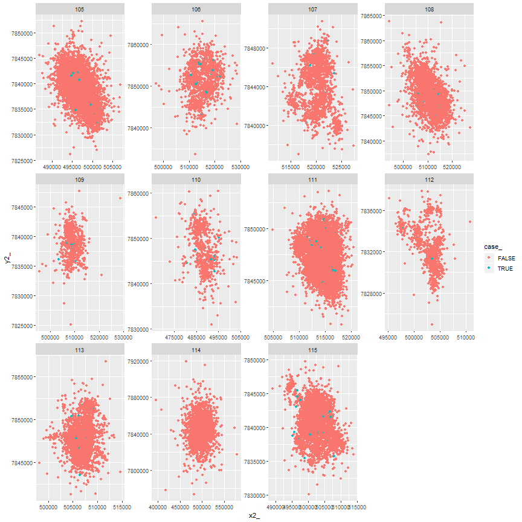

## Write out data for further annotating
 With the SSFs, we have the extra complication of
having a time and location at both the start and end of the step.  

For the time being, we will assume we want to annotate variables at the end of the step
but use the starting point of the step as the timestamp.


```r
ssf.df <- data.frame(ssfdat)
head(ssf.df)
```

```
##   burst_ step_id_ case_    x1_     y1_      x2_     y2_                 t1_                 t2_     dt_       sl_        ta_  id
## 1      1        1  TRUE 499215 7843729 499850.0 7843991 2008-06-20 13:00:00 2008-06-20 16:00:00 3 hours  686.9283  177.74377 115
## 2      1        1 FALSE 499215 7843729 499297.3 7843817 2008-06-20 13:00:00 2008-06-20 16:00:00 3 hours  120.7423 -156.25858 115
## 3      1        1 FALSE 499215 7843729 499234.8 7843521 2008-06-20 13:00:00 2008-06-20 16:00:00 3 hours  209.3001  -70.59131 115
## 4      1        1 FALSE 499215 7843729 496793.3 7847524 2008-06-20 13:00:00 2008-06-20 16:00:00 3 hours 4501.6902  -10.42758 115
## 5      1        1 FALSE 499215 7843729 499129.6 7843615 2008-06-20 13:00:00 2008-06-20 16:00:00 3 hours  142.1849  -33.63135 115
## 6      1        1 FALSE 499215 7843729 499460.3 7843982 2008-06-20 13:00:00 2008-06-20 16:00:00 3 hours  352.0953 -168.84581 115
```

```r
ssf.df$timestamp <-ssf.df$t1_
ssf.df$x <-ssf.df$x2_
ssf.df$y <-ssf.df$y2_
head(ssf.df)
```

```
##   burst_ step_id_ case_    x1_     y1_      x2_     y2_                 t1_                 t2_     dt_       sl_        ta_  id           timestamp        x
## 1      1        1  TRUE 499215 7843729 499850.0 7843991 2008-06-20 13:00:00 2008-06-20 16:00:00 3 hours  686.9283  177.74377 115 2008-06-20 13:00:00 499850.0
## 2      1        1 FALSE 499215 7843729 499297.3 7843817 2008-06-20 13:00:00 2008-06-20 16:00:00 3 hours  120.7423 -156.25858 115 2008-06-20 13:00:00 499297.3
## 3      1        1 FALSE 499215 7843729 499234.8 7843521 2008-06-20 13:00:00 2008-06-20 16:00:00 3 hours  209.3001  -70.59131 115 2008-06-20 13:00:00 499234.8
## 4      1        1 FALSE 499215 7843729 496793.3 7847524 2008-06-20 13:00:00 2008-06-20 16:00:00 3 hours 4501.6902  -10.42758 115 2008-06-20 13:00:00 496793.3
## 5      1        1 FALSE 499215 7843729 499129.6 7843615 2008-06-20 13:00:00 2008-06-20 16:00:00 3 hours  142.1849  -33.63135 115 2008-06-20 13:00:00 499129.6
## 6      1        1 FALSE 499215 7843729 499460.3 7843982 2008-06-20 13:00:00 2008-06-20 16:00:00 3 hours  352.0953 -168.84581 115 2008-06-20 13:00:00 499460.3
##         y
## 1 7843991
## 2 7843817
## 3 7843521
## 4 7847524
## 5 7843615
## 6 7843982
```

```r
ssfALL<-ssf.df
head(ssfALL)
```

```
##   burst_ step_id_ case_    x1_     y1_      x2_     y2_                 t1_                 t2_     dt_       sl_        ta_  id           timestamp        x
## 1      1        1  TRUE 499215 7843729 499850.0 7843991 2008-06-20 13:00:00 2008-06-20 16:00:00 3 hours  686.9283  177.74377 115 2008-06-20 13:00:00 499850.0
## 2      1        1 FALSE 499215 7843729 499297.3 7843817 2008-06-20 13:00:00 2008-06-20 16:00:00 3 hours  120.7423 -156.25858 115 2008-06-20 13:00:00 499297.3
## 3      1        1 FALSE 499215 7843729 499234.8 7843521 2008-06-20 13:00:00 2008-06-20 16:00:00 3 hours  209.3001  -70.59131 115 2008-06-20 13:00:00 499234.8
## 4      1        1 FALSE 499215 7843729 496793.3 7847524 2008-06-20 13:00:00 2008-06-20 16:00:00 3 hours 4501.6902  -10.42758 115 2008-06-20 13:00:00 496793.3
## 5      1        1 FALSE 499215 7843729 499129.6 7843615 2008-06-20 13:00:00 2008-06-20 16:00:00 3 hours  142.1849  -33.63135 115 2008-06-20 13:00:00 499129.6
## 6      1        1 FALSE 499215 7843729 499460.3 7843982 2008-06-20 13:00:00 2008-06-20 16:00:00 3 hours  352.0953 -168.84581 115 2008-06-20 13:00:00 499460.3
##         y
## 1 7843991
## 2 7843817
## 3 7843521
## 4 7847524
## 5 7843615
## 6 7843982
```

```r
#ssfALL$sl_ <- NULL; ssfALL$ta_<- NULL
ssfALL<-ssfALL%>% mutate(obs = 1:n()) %>% select(obs, everything())
head(ssfALL)
```

```
##   obs burst_ step_id_ case_    x1_     y1_      x2_     y2_                 t1_                 t2_     dt_       sl_        ta_  id           timestamp        x
## 1   1      1        1  TRUE 499215 7843729 499850.0 7843991 2008-06-20 13:00:00 2008-06-20 16:00:00 3 hours  686.9283  177.74377 115 2008-06-20 13:00:00 499850.0
## 2   2      1        1 FALSE 499215 7843729 499297.3 7843817 2008-06-20 13:00:00 2008-06-20 16:00:00 3 hours  120.7423 -156.25858 115 2008-06-20 13:00:00 499297.3
## 3   3      1        1 FALSE 499215 7843729 499234.8 7843521 2008-06-20 13:00:00 2008-06-20 16:00:00 3 hours  209.3001  -70.59131 115 2008-06-20 13:00:00 499234.8
## 4   4      1        1 FALSE 499215 7843729 496793.3 7847524 2008-06-20 13:00:00 2008-06-20 16:00:00 3 hours 4501.6902  -10.42758 115 2008-06-20 13:00:00 496793.3
## 5   5      1        1 FALSE 499215 7843729 499129.6 7843615 2008-06-20 13:00:00 2008-06-20 16:00:00 3 hours  142.1849  -33.63135 115 2008-06-20 13:00:00 499129.6
## 6   6      1        1 FALSE 499215 7843729 499460.3 7843982 2008-06-20 13:00:00 2008-06-20 16:00:00 3 hours  352.0953 -168.84581 115 2008-06-20 13:00:00 499460.3
##         y
## 1 7843991
## 2 7843817
## 3 7843521
## 4 7847524
## 5 7843615
## 6 7843982
```

```r
#stepSB<-ssfALL %>% select("obs","id","case_", "x", "y","timestamp","step_id_")
#head(stepSB)
#AllSteps <- ssf.df  ### include name of the area/ project
```

These points then need to be annotated prior to fitting ssfs. 2 files All and to annotate


```r
#write.csv(ssfALL, file="C:/RWorkDir/jaguardatapaper/ssfALL.csv", row.names = FALSE) ###annotated_projectname
#write.csv(stepSB, file="C:/RWorkDir/jaguardatapaper/stepSB.csv", row.names = FALSE) ###annotated_projectname
```


```r
#" Simplify some variable names and make case a numeric variable
ssfdat$case_<-as.numeric(ssfdat$case)
```

```
## Warning: Unknown or uninitialised column: 'case'.
```

```
## Error in `$<-.data.frame`(`*tmp*`, case_, value = numeric(0)): replacement has 0 rows, data has 87936
```

landcover classes 


```r
ssfdat$land_cover <-as.factor(ssfdat$land_cover)
```

```
## Warning: Unknown or uninitialised column: 'land_cover'.
```

```
## Error in `$<-.data.frame`(`*tmp*`, land_cover, value = structure(integer(0), .Label = character(0), class = "factor")): replacement has 0 rows, data has 87936
```

```r
ssfdat<-ssfdat %>% mutate(land_C = fct_collapse(land_use,
                                                crop = c("10", "20"),
                                                mosaic_crop = c("30"),
                                                forest =c("60","70","80"),
                                                mosaic_treeshrub =c("100"),
                                                mosaic_herb =c("110"),
                                                sparse_tsh =c("150"),
                                                flood_tree =c("160","170"),
                                                flood_shrubherb = c("180"),
                                                shrub= c("120"),
                                                grass = c("130"),
                                                water= c("210"),
                                                urban = c("190"),
                                                bare = c("200")))
```

```
## Error in mutate_impl(.data, dots): Evaluation error: object 'land_use' not found.
```

